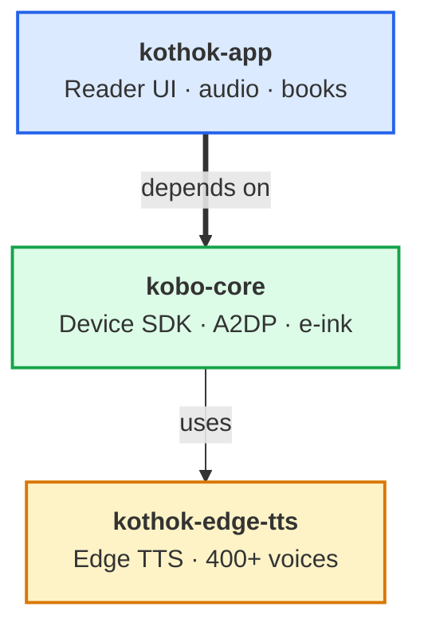
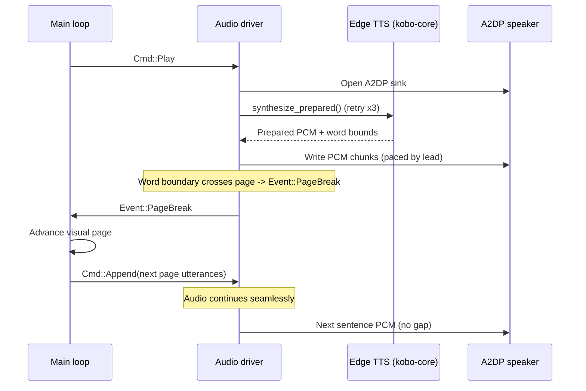
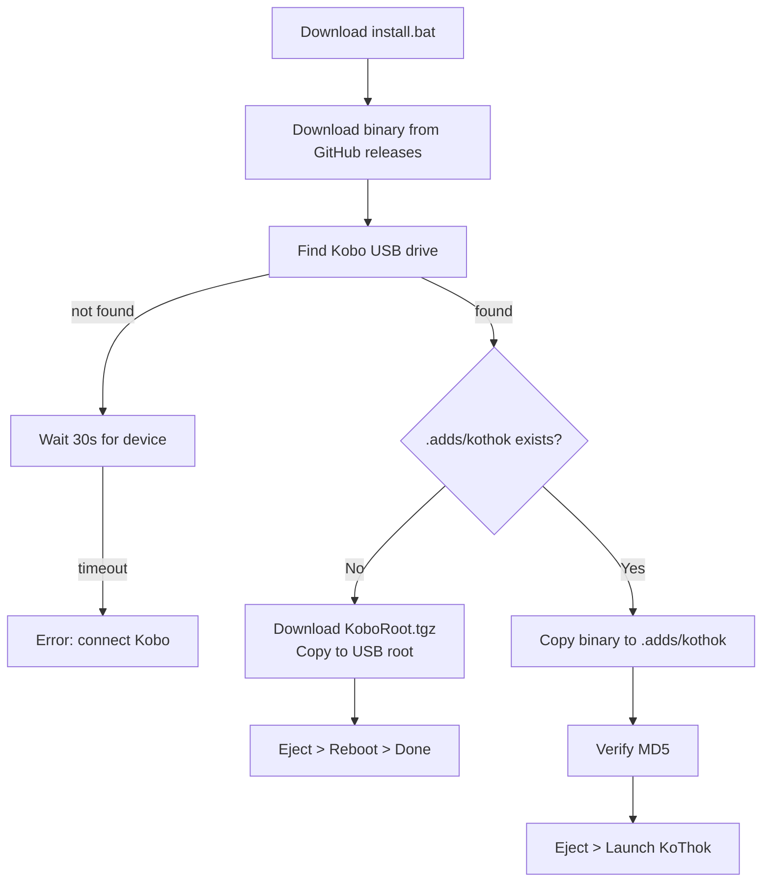
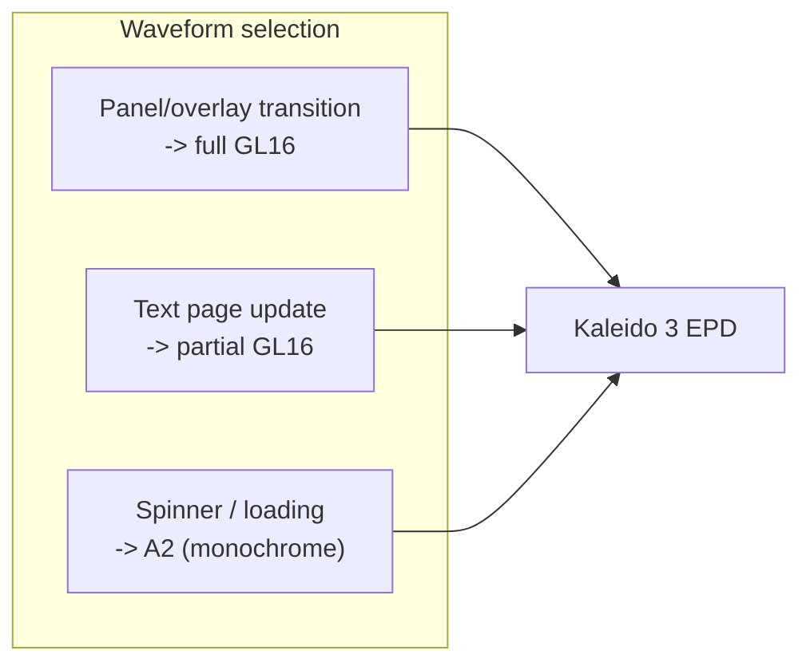

# KoThok


A custom e-reader application for **Kobo devices** (Clara Colour, Libra Colour,
and all MTK/NXP models), written in Rust. Renders directly to the e-ink
framebuffer with Bluetooth (A2DP) audio / read-aloud via Microsoft Edge TTS.

KoThok is launched from a NickelMenu entry; it stops the stock "nickel" UI on
entry and reboots back to nickel on exit.

## Architecture

KoThok separates the **reader app** from two **reusable libraries**. One for
Kobo hardware, one for text-to-speech. Each layer evolves independently and
can be reused in other projects.



| Repo | Role |
|---|---|
| **EReader** (this) | Reader app: Slint UI, main loop, audio driver, book picker, control panel |
| [**kobo-core**](https://crates.io/crates/kobo-core) | Device SDK: framebuffer, touch, frontlight, fonts, EPUB, A2DP audio |
| [**kothok-edge-tts**](https://crates.io/crates/kothok-edge-tts) | Edge TTS client: WebSocket protocol, 400+ voices, MP3 + word boundaries |

## What's new

See [CHANGELOG.md](CHANGELOG.md) for release history and feature list.

## Read-aloud audio pipeline



## Install

**3 steps, no build tools needed:**

1. **Download** `install.bat` (Windows) or `install.sh` (Linux/macOS) from this repo
2. **Plug in** your Kobo via USB
3. **Double-click** the installer

The installer downloads the latest binary from GitHub releases, copies it to
your Kobo, and verifies the transfer. First install sets up NickelMenu
automatically; every update is just step 3 again.

| OS | Download | Run |
|---|---|---|
| Windows | `install.bat` | Double-click |
| macOS | `install.command` | Double-click in Finder |
| Linux | `install.sh` | `./install.sh` |

**Requirements:** internet connection, PowerShell 7 (`pwsh`).

## Install flow



The installer (`install.ps1`) fetches the latest binary from GitHub releases.
For developers building from source, use `kothok/scripts/deploy.ps1`.

Device target: `/mnt/onboard/.adds/kothok`
Logs: `/mnt/onboard/.adds/kothok.log`

## E-ink rendering strategy



| Scenario | Waveform | Update | Why |
|---|---|---|---|
| Menu open/close | GL16 | Full | Clears ghosting, no black flash |
| Page turn (swipe/TTS) | GL16 | Partial | Less ghosting, preserves color |
| Spinner animation | A2 | Partial | Fastest monochrome |

## Repository layout

```
EReader/
├─ installer/                     install scripts (download from website)
│  ├─ install.bat                 Windows launcher
│  ├─ install.command             macOS launcher
│  ├─ install.sh                  Linux launcher
│  └─ install.ps1                 downloads binary from GitHub releases
├─ CHANGELOG.md                  release history
├─ kothok/                       Rust workspace (single crate)
│  ├─ src/                       Rust source (main loop, audio, rendering, panel)
│  ├─ ui/                        Slint UI components
│  ├─ scripts/deploy.ps1         build + deploy (for developers)
│  ├─ package/                   NickelMenu config + assets
│  ├─ run.sh                     device launcher (kills nickel, reboots on exit)
│  ├─ Cargo.toml                 workspace + package config
│  └─ Cross.toml                 cross-build config
└─ README.md                     this file
```

## For developers

**Build from source:**

```bash
# Prerequisites: Rust, Docker, cross
cross build --target armv7-unknown-linux-musleabihf --release -p kothok-app

# Run tests
cross test -p kothok-app --target armv7-unknown-linux-musleabihf
```

**Deploy to device (build + copy + verify):**

```bash
pwsh kothok/scripts/deploy.ps1
```

**Create release:**

1. Update version in `kothok/Cargo.toml`
2. Update `CHANGELOG.md` with what's new
3. Build, then copy binary to `release/` folder with version suffix:
   ```bash
   cp kothok/target/armv7-unknown-linux-musleabihf/release/kothok release/kothok-0.1.0
   ```
4. Upload `release/kothok-0.1.0` and `release/KoboRoot.tgz` to GitHub releases
5. Tag the release: `git tag v0.1.0`

## License

MIT
