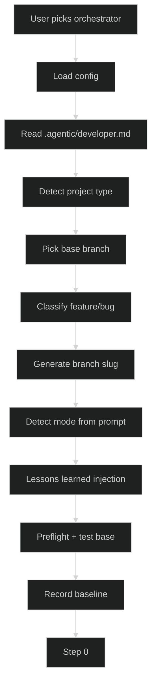
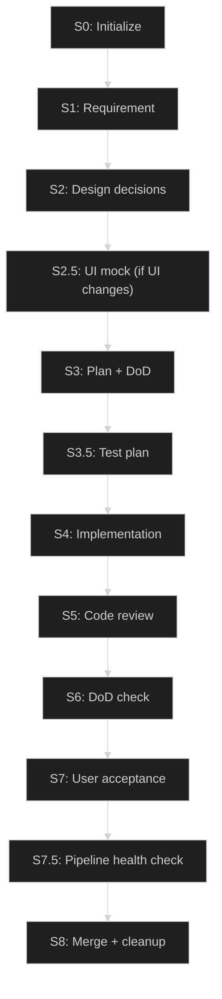
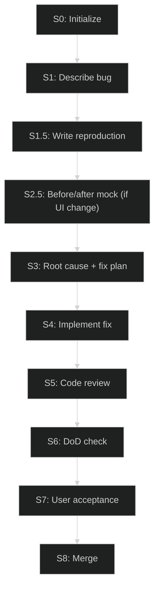
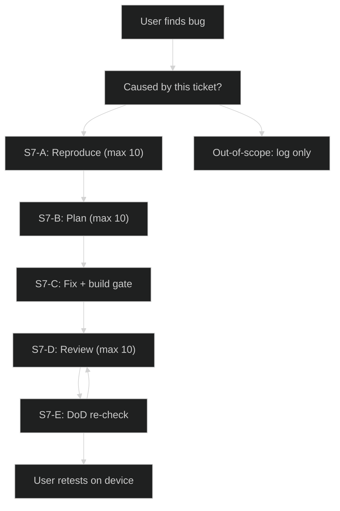
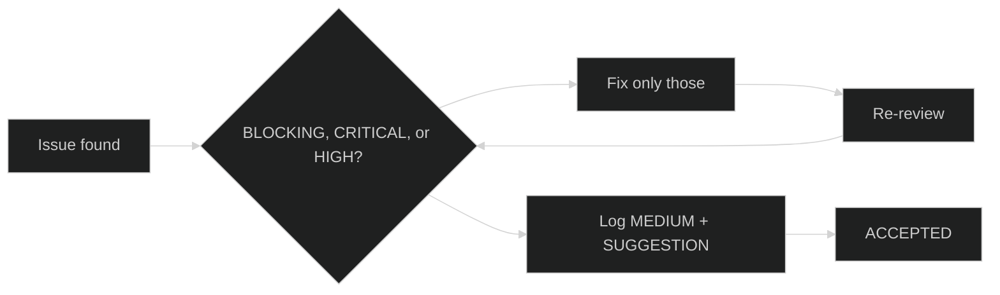
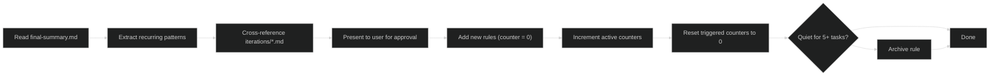
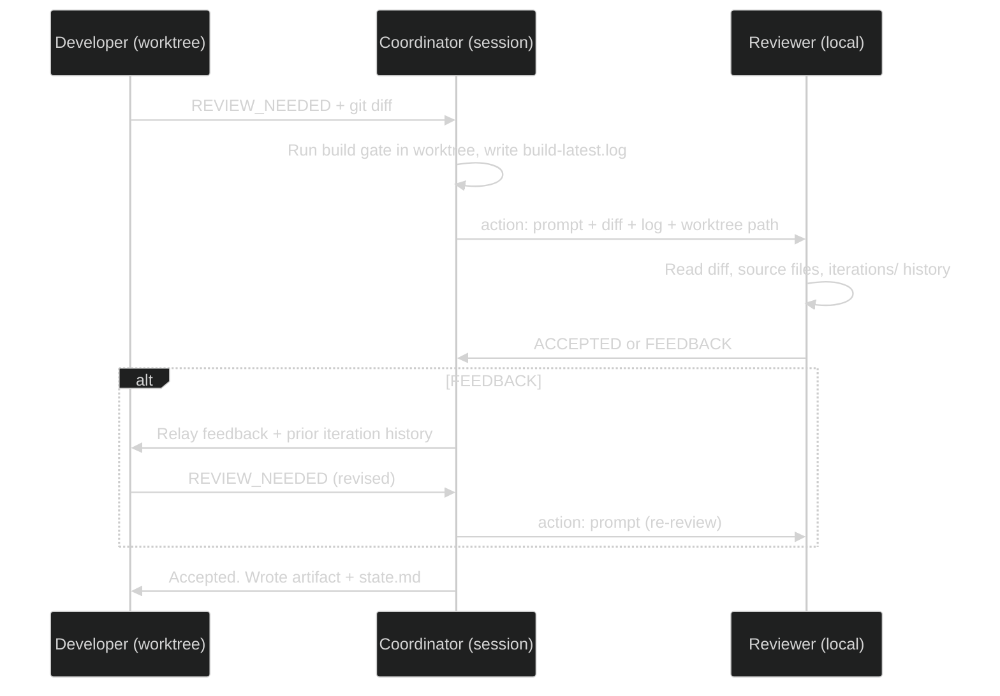
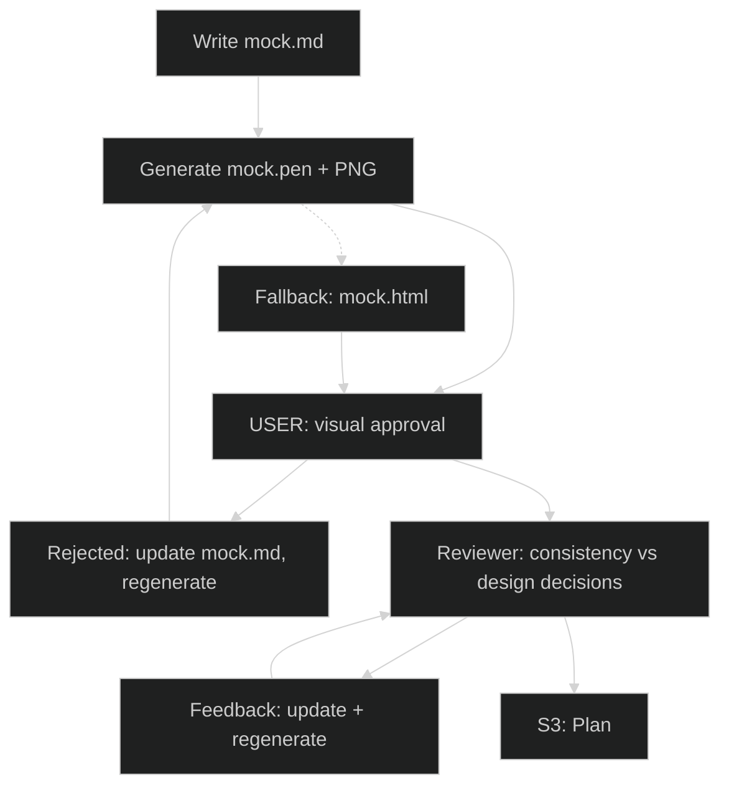
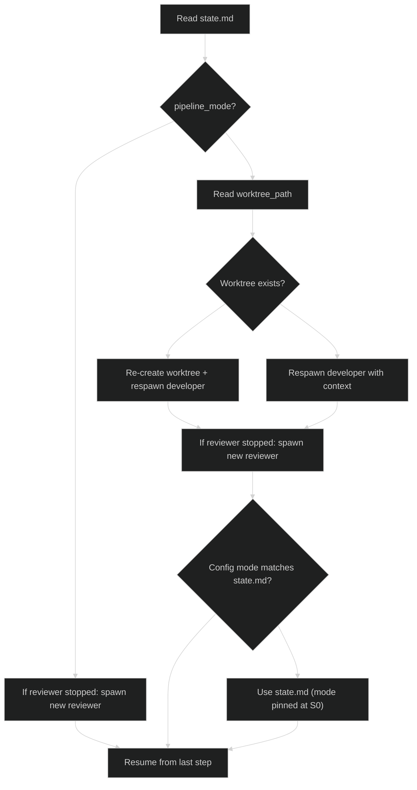

# Agentic Pipeline Reference

Current implementation as of 2026-07-31. This document describes how the agentic pipeline works. For the executable instructions, see the source of truth files listed below.

## Source of truth

The pipeline is defined across several files. When they disagree, this priority order applies:

| Priority | File | Scope |
|----------|------|-------|
| 1 (highest) | `.agentic/config.md` | Build commands, model IDs, deploy instructions, pen_cli |
| 2 | `.agentic/orchestrator.md` | Project-specific overrides only (device test, git ops, Agent Manager wiring) |
| 3 | `~/.config/kilo/agent/agentic-orchestrator.md` | Full pipeline flow, step definitions, relay protocol, conduct rules (D01-D03, V01), pipeline rules (P##) |
| 4 | `.agentic/reviewer.md` | Project review checklist and any declared severity/decision deltas |
| 5 | `~/.config/kilo/SHARED_CONVENTIONS.md` | Commit style, AI cleanup, secrets, severity table |
| 6 | `docs/REVIEW_RULES.md` | Project code rules (auto-growing, read by reviewer every iteration) |
| 7 (lowest) | `AGENTS.md` | Project-wide facts, device constraints, build/deploy commands |

No pipeline logic is duplicated between global and project files. The global orchestrator owns every step definition, the relay protocol, the conduct rules, and the pipeline rules. Project files carry only what is specific to this repo.

Templates live in two locations. Project templates override global templates when both exist, whole-file -- there is no section-level inheritance, so a project template must be complete:

| Location | Purpose | Example contents |
|----------|---------|-----------------|
| `~/.config/kilo/agent/task-template/` | Generic, project-agnostic | state.md, plan.md, final-summary.md, iteration-review.md, iteration-response.md |
| `.agentic/task-template/` | Project-specific only | mock.md (Kobo dimensions), definition-of-done.md (cross build) |

## What the pipeline does

The pipeline takes a user request ("add word list selection" or "fix scrollbar regression") and produces a merged, tested, reviewed change on the develop branch. It handles the full lifecycle: understanding the requirement, making design decisions, planning the implementation, writing code, getting it reviewed, verifying it does what was promised, and merging it.

Two pipeline types:
- **Feature**: new behavior. Flows through design decisions, optional UI mock, plan, test plan, implementation, review, DoD check, user test, merge.
- **Bug fix**: broken behavior. Replaces design decisions with a reproduction step (write a failing test first), then root cause analysis, then fix.

## Pipeline modes

The pipeline runs in one of two modes. Direct is the default. Worktree activates when the user's command mentions worktree, parallel work, or multiple tickets.

### Direct mode (default)

The orchestrator IS the developer. Everything happens in the current VS Code session: reading code, writing code, running builds, committing. One reviewer subagent is spawned for review steps.

```
User request -> [Orchestrator (current session) = Developer] --artifacts--> [Reviewer (Agent Manager)]
               <- feedback - - - - - - - - - - - - - - - - - - <- ACCEPTED/FEEDBACK
```

Use this for single tickets. Simpler, lower latency, full file access.

In direct mode the orchestrator also reads `.agentic/developer.md` at startup if it exists -- that file governs its own implementation work (build gate, naming, testing conventions, build-latest.log format).

### Worktree mode

The orchestrator becomes a coordinator. It spawns two Agent Manager sessions -- a developer in an isolated git worktree and a reviewer in the local session -- and relays between them and the user. The coordinator does not write code.

```
                       [Developer (worktree)] --REVIEW_NEEDED--> [Coordinator]
[User] ---USER_NEEDED->                                                        |
                       [Reviewer (local)] --ACCEPTED/FEEDBACK-->             |
                        <--artifacts/review feedback--                   |
```

Use this for parallel work on multiple tickets. Each ticket gets its own worktree and reviewer. The coordinator presents pending user gates in order.

Constraint: Agent Manager subagents cannot spawn their own subagents. The coordinator must spawn both sessions and handle all routing. Device testing is still sequential (one binary, one Kobo).

### How mode is chosen

At startup, the pipeline inspects the user's command/request. If it mentions worktree, parallel work, multiple tickets, or similar terms, the pipeline uses worktree. Otherwise, it defaults to direct. No config field controls this -- it's detected from the prompt.

**Mode is fixed at Step 0.** Once the pipeline starts, `pipeline_mode` is written to `state.md`. If someone edits `config.md` mid-ticket, the pipeline ignores the change and uses the `state.md` value. This prevents a silent architecture switch during a resumed session.

## Startup sequence



At startup, the pipeline:
1. Reads project config (`.agentic/config.md`) or falls back to `AGENTS.md`/`CLAUDE.md`
2. Reads `.agentic/developer.md` if present (direct mode: governs its own work; worktree mode: prepended to the developer subagent prompt)
3. Auto-detects project type from file structure (Cargo.toml, package.json, etc.)
4. Determines the base branch (prefers `develop`/`dev`, else `main`)
5. Classifies the ticket as feature or bug (sets branch prefix: `feat/` or `fix/`)
6. Generates a branch slug (replace `/` with `-`, e.g. `feat/word-list-flow` becomes `feat-word-list-flow`)
7. Detects the pipeline mode from the user's request (not from config)
8. Reads model IDs: `reviewer_id` + `reviewer_variant` for the reviewer, `developer_id` + `developer_variant` for worktree mode
9. Runs the lessons learned injection (below)
10. Runs preflight if configured, then tests the base branch, and records the test baseline

### Lessons learned injection (Step 0)

Before any work starts, the pipeline scans the **last 3 completed tasks'** `final-summary.md` files (state.md phase S8, or ABORTED with a valid summary), extracts their "Preventive rules generated" and "Pipeline health" recommendations, and injects them as context: "Known pitfalls from previous tasks: ... Pipeline improvements: ...". If no prior completed task exists, the step is skipped.

Reading three summaries rather than one means a single trivial ticket with an empty findings section cannot erase accumulated context.

### Step 0: Initialize

This is the shared entry point. Steps 1-4 are the same in both modes. Steps 5+ differ.

**Shared (all modes):**
1. Run preflight **if a `preflight` command exists in config**. If it fails, stop and report to the user. If none is configured, skip.
2. Run the test command on the base branch. If tests fail, stop. A red base branch means every downstream test delta is unreliable. Do not record a failing baseline.
3. If tests pass, extract the passed count: parse `TOTAL PASSED: N` if present, else the framework-specific pattern (cargo `test result: ok. N passed`, dotnet `Passed: N`, pytest `N passed`). Record it as `tests_baseline`.
4. Create the feature branch from the base branch.

**Direct mode (steps 5-7):**
5. Create the task directory `.agentic-tasks/<branch-slug>/` and copy templates into it.
6. Spawn the reviewer via Agent Manager.
7. Write `state.md` with `started_at`, `tests_baseline`, `pipeline_mode: direct`, and the S0 phase_log entry.

**Worktree mode (steps 5-9):**
5. Create the task directory in the main working directory (NOT the worktree). Copy templates.
6. Spawn the developer worktree via Agent Manager.
7. Discover the worktree path via `git worktree list`. Hold in memory (state.md not yet created).
8. Spawn the reviewer via Agent Manager.
9. Write `state.md` with `started_at`, `tests_baseline`, `pipeline_mode: worktree`, `worktree_path`, and the S0 phase_log entry.

## Feature pipeline



| Step | What happens | Output | Passes when |
|------|-------------|--------|-------------|
| S0 | Lessons learned injected from last 3 tasks, preflight (if configured), base branch tested, branch created | Branch from develop, `tests_baseline` recorded | Preflight exits 0 and tests pass |
| S1 | Developer reads codebase, asks user to clarify if needed | `requirement.md` | Developer writes it |
| S2 | Developer proposes options, reviewer filters infeasible ones, user picks from what remains | `design-decisions.md` | User chose an option |
| S2.5 | Developer generates UI mock (Pencil), **user approves visually first**, then reviewer checks consistency against design decisions | `mock.pen`, `mock-preview.png`, `mock.md` | Skipped if no UI changes. Else user approves, then reviewer accepts (max 10 rounds) |
| S3 | Developer writes plan with architecture, files, risks, DoD. Reviewer reviews against actual source | `plan.md`, `definition-of-done.md` | Reviewer accepts plan (developer fixes feedback, max 10 rounds) |
| S3.5 | Developer writes test scenarios (no code). Reviewer checks coverage completeness | `test-plan.md` | Reviewer accepts coverage (developer fixes feedback, max 10 rounds) |
| S4 | Developer writes code + tests. Build gate runs (build, test, lint, fmt, gitleaks). Clean tree verified | Commit on branch, `build-latest.log` | All gates pass, tree clean outside `.agentic-tasks/` |
| S5 | Reviewer reads git diff + build log + iteration history. Feedback loop: developer fixes, rebuilds, re-submits | `iterations/N-review.md`, `iterations/N-response.md` | Reviewer says ACCEPTED (max 10 feedback rounds) |
| S6 | Reviewer reads source files and checks every DoD item against actual code | DoD verification result | Every item passes. Missing impl items go to S5; plan gaps go to S3 |
| S7 | Deploy instruction printed. User deploys to device, tests | User verdict (bug sub / S5 / S3 / abort / confirmed) | User confirmed |
| S7.5 | Pipeline scans its own iteration files for relay failures, avoidance patterns, enforcement gaps | "Pipeline health" section in the S7 summary | Always runs before S8 |
| S8 | Merge base into feature, rebuild, retest, reviewer reviews conflicts, user confirms push, end-of-task analysis, review rules lifecycle | `final-summary.md`, `merge-verify-build.log`, develop updated, new rules | User confirmed push |

### Step-by-step walkthrough

**S1: Requirement.** The developer reads the codebase to understand the request, asks the user clarifying questions if needed, and writes `requirement.md`. The output is a clear, unambiguous description of what the ticket should deliver.

**S2: Design decisions.** The developer researches implementation options, sends them to the reviewer for feasibility filtering (the reviewer reads actual source to verify claims), then presents the feasible options to the user. The user chooses. The chosen decisions are written to `design-decisions.md`. If the ticket involves UI changes, the pipeline routes to S2.5 next; otherwise, straight to S3.

**S2.5: UI mock.** Only for tickets with UI changes. The developer writes `mock.md` describing the screens, device dimensions, interactive states, and approved design decisions. The Pencil CLI (`pen_cli` from config, default `pen`) generates `mock.pen` and a preview PNG. **The user sees the rendered preview and approves it first** -- the user is the only party that can reliably see the image. After user approval, the reviewer checks the mock against the design decisions and device viewport (max 10 iterations). If Pencil is unavailable, falls back to `mock.html`, reviewed in the same order.

**S3: Plan + DoD.** The developer writes `plan.md` with architecture, files to change, risks, and the definition of done (DoD). The DoD is extracted into `definition-of-done.md`. The reviewer checks the plan against actual source code. Each DoD item must have a pass/fail criterion.

**S3.5: Test plan.** The developer writes `test-plan.md` with test scenarios (no code, just descriptions). The reviewer checks coverage completeness: happy path, edge cases, device-specific risks.

**S4: Implementation.** The developer writes code and tests. The **orchestrator (direct mode) or coordinator (worktree mode) runs the build gate itself** -- preflight, build, test, lint, fmt check -- and captures the real command output into `build-latest.log` with the `HEAD`, `TREE`, and `TOTAL PASSED` header lines derived from actual `git status` and test output. It does not transcribe a developer self-report. The tree must be clean outside `.agentic-tasks/`.

**S5: Code + test review.** The reviewer reads the full git diff and `build-latest.log`, and reads `.agentic-tasks/<branch-slug>/iterations/` off disk as the authoritative feedback history. Read-only git commands (`git status`, `git diff`, `git rev-parse`, `git show`, `git log`) are permitted and encouraged so the reviewer can verify the log's claims independently. Feedback loops up to 10 iterations per review step. Only BLOCKING, CRITICAL, and HIGH issues must be fixed; MEDIUM and SUGGESTION never gate.

**S6: DoD verification.** The reviewer reads actual source files and checks every item in `definition-of-done.md`. Routing depends on why an item failed: incomplete implementation routes back to S5; an item the **plan** omitted routes back to S3 for a replan.

**S7: User acceptance.** The pipeline presents a summary, diff, and build results to the user. The user deploys to the device and tests. Feedback routes:
- New bug caused by this ticket -> bug-fix sub-pipeline (S7-A through S7-E)
- Simple code bug -> back to S5
- Design flaw -> back to S3 (replan)
- Abort -> abort path
- Confirmed -> S7.5, then S8

**S7.5: Pipeline health check.** Before merging, the pipeline audits its own run by scanning every iteration file:
- The same issue flagged 3+ times -> relay bug or developer avoidance. Flagged to the user.
- The user had to repeat instructions the pipeline already received -> orchestrator context loss. Flagged to the user.
- The reviewer re-flagged an already-fixed item -> V01 violation, logged for reviewer improvement.
- The developer deferred a BLOCKING item -> D02 enforcement gap, logged for the next task.

Findings appear as a "Pipeline health" section in the S7 acceptance summary, with self-healing suggestions ("the pipeline retried issue X three times; suggest rule R##"). S8 reuses these findings rather than re-scanning.

**S8: Merge + cleanup.** See the merge sequence below.

### S8 merge sequence (direct mode)

1. `git fetch origin`, checkout and pull base. Re-run the test command on the updated base and write `tests_base_at_merge` to `state.md` **immediately** -- this detects test drift on base between S0 and merge, and survives a crash later in the sequence.
2. Merge base into the feature branch, resolve conflicts.
3. Rebuild + retest. Dump `merge-verify-build.log`. **If merge-verify fails, route to S5 with the failure log. Do not proceed to push.**
4. Reviewer reviews the conflict resolutions.
5. Ask the user for explicit confirmation before pushing (branch, commit count, build result).
6. `git fetch origin` again and verify base has not moved since step 1. If it diverged, stop and report. If clean, `git merge --no-ff` and push.
7. Write `state.md` with `phase = S8`.
8. Create `final-summary.md` from the global template.
9. End-of-task analysis (below).
10. On user approval, write new rules: R##/D## to `docs/REVIEW_RULES.md`, P## to the "Pipeline rules" section of the global orchestrator.
11. Review rules lifecycle.
12. Stop the reviewer session. In worktree mode, `git worktree remove` runs after stopping sessions and before any branch delete.

### End-of-task analysis (S8)

The pipeline reuses the S7.5 findings and categorizes every feedback item from the run:

| Category | Becomes | Written to |
|----------|---------|-----------|
| Recurring code pattern | R## | `docs/REVIEW_RULES.md` |
| Developer conduct gap | D## | global orchestrator conduct rules |
| Pipeline relay/orchestration issue | P## | global orchestrator "Pipeline rules" section |
| Design gap | note | final-summary, feeds the next plan |

Findings land in the `final-summary.md` "Feedback analysis", "Pipeline health", and "Preventive rules generated" sections -- the last of which is what the next task's lessons learned injection reads. **New rules are presented to the user and written only on approval.**

## Bug pipeline

Bug tickets follow the same structure but replace S2 (design decisions) with S1.5 (reproduction). After S1.5 acceptance, if the fix changes UI layout or interaction, it routes through S2.5 (mock) before S3 -- this captures the before/after layout so the user can approve the visual change before code is written.



### S1.5: Bug reproduction

The developer writes a reproduction artifact based on bug type (the rows below are illustrative -- use the project-appropriate equivalent):

| Bug type | Reproduction | Automated? |
|----------|-------------|------------|
| Logic/state | Unit test that FAILS | Yes |
| API/contract | Integration test that FAILS | Yes |
| Component state | Framework test (e.g., i-slint-backend-testing) | Yes |
| Layout/geometry | Framework test asserting element geometry | Yes |
| Rendering | Screenshot test vs expected output | Yes |
| Touch/interaction | Framework test simulating input events | Yes |
| Animation/timing | Given/When/Then script | No |
| Hardware-dependent (e-ink, frontlight, sleep) | Given/When/Then script | No |

For automated: write a test that currently FAILS. Do NOT fix the bug yet. The reviewer checks that the test actually reproduces the bug, is isolated, and is realistic.

For manual: write `bug-reproduction.md` with exact preconditions, steps, expected vs actual result, and acceptance criteria.

### S3: Root cause + fix plan (bug pipeline)

After S1.5 acceptance (and optional S2.5 mock), the developer writes `plan.md` with root cause analysis pointing to a specific `file:line`, the fix approach, side effects, out-of-scope items, and DoD. The reviewer checks that the root cause matches the reproduction and the fix is minimal and targeted.

### S4: Implement fix

The reproduction test must now PASS. For manual reproductions, the fix logic must address each step in `bug-reproduction.md`. Build gate runs, commit, build-latest.log captured by the orchestrator.

## Bug-fix sub-pipeline (within S7)

Triggered when the user finds a new bug during device testing that was caused by this ticket's changes. Pre-existing bugs are logged but never fixed on the ticket branch.



Each sub-pipeline loop increments both its own counter (`bug_repro`, `bug_plan`, `bug_code`) and `global_iterations`.

## Review severity levels

Five severity levels, three behaviors:

| Severity | Gates? | When to use | Action |
|----------|--------|-------------|--------|
| BLOCKING | Yes | Build broken, artifact missing, wrong branch, no tests run | Fix now. |
| CRITICAL | Yes | Security issue, data loss risk, broken core invariant | Fix now. |
| HIGH | Yes | Significant correctness or design concern | Fix now. |
| MEDIUM | No | Test gap, minor design issue, non-critical improvement | Log. Fix if cheap. Does not gate. |
| SUGGESTION | No | Style, naming, minor clarity improvement | Log only. Does not gate. |



Key rules:
- No sweep rule. A blocking fix must be minimal and targeted, not bundled with unrelated changes.
- MEDIUM and SUGGESTION never prevent acceptance. They are logged, and fixed only if cheap.
- The reviewer responds with exactly one word: `ACCEPTED` or `FEEDBACK`. Never both.
- The severity spec, gate rules, and decision criteria are **always** sent to the reviewer from the global orchestrator. `.agentic/reviewer.md` overrides only the sections it explicitly redefines; everything else applies as written.

## Conduct rules

Enforced globally on every project, unconditionally. Code rules (R##) are per-project and live in `docs/REVIEW_RULES.md`.

| Rule | Applies to | What it requires |
|------|-----------|-----------------|
| D01 | Developer | Every feedback item gets a matching response with the changed `file:line`. Prior fixes referenced as "fixed in iteration N at file:line". |
| D02 | Developer | BLOCKING items are never deferrable. SUGGESTION items deferrable only with explicit reviewer agreement. No unrelated refactoring as a substitute. |
| D03 | Developer | Re-run the build gate and re-check the flagged `file:line` before resubmitting. |
| V01 | Reviewer | No repeated feedback. Check prior iteration responses before flagging; if addressed, verify the fix rather than re-flagging. Audited by the orchestrator at S7.5. |
| P## | Pipeline | Generated by end-of-task analysis, stored in the global orchestrator's "Pipeline rules" section, retired after 5+ quiet tasks. |

The reviewer reads the iteration history from `.agentic-tasks/<branch-slug>/iterations/` on disk rather than trusting what a prompt included. This keeps V01 auditable and survives a restart that loses the reviewer session.

## Iteration limits

| Limit | Value | Scope |
|-------|-------|-------|
| Per-loop cap | 10 iterations | Per review step (mock, plan, test plan, code, etc.) |
| Global cap | 50 iterations | Per pipeline (per task/branch) |

When a per-loop cap is hit, the pipeline stops the feedback loop and presents the remaining feedback plus the best attempt to the user. The user chooses:
1. **Accept as-is** -- phase marked complete, proceed
2. **Abort** -- full pipeline abort
3. **Override** -- reset the per-loop counter to 0, continue (increments global)

**When the global cap (50) is hit, the pipeline stops and presents the same three choices.** It writes `state.md`, keeps the branch, and waits. It does not abort automatically and never force-deletes a branch on a counter breach -- branch deletion always requires explicit user confirmation.

Limits are per-pipeline. When running multiple parallel pipelines in worktree mode, each has its own independent budget in its own `state.md`. A coordinator must never sum iterations across branches.

## Iteration counters

Tracked in `state.md` per ticket. These are used as the pipeline cost metric (not tokens, since Kilo does not expose a token counter):

```yaml
phase_iterations:
  bug_repro: 0    # S1.5 reviews (features: always 0)
  bug_plan: 0     # S7-B plan reviews (features: always 0)
  bug_code: 0     # S7-D code reviews (features: always 0)
  mock: 0         # S2.5 mock reviews
  plan: 0         # S3 plan reviews
  test_plan: 0    # S3.5 test plan reviews
  code: 0         # S5 code review iterations
```

## Gating checkpoints

| Gate | Where | What it checks | Fails if |
|------|-------|---------------|----------|
| Preflight | S0 | Docker running (or whatever preflight command is), when configured | Preflight command exits non-zero |
| Baseline tests | S0 | Base branch tests pass | Tests fail on base branch |
| Build gate | S4 exit | preflight, build, test, lint, fmt check all pass; output captured by the orchestrator | Any command fails |
| Gitleaks | S4 commit | No hardcoded secrets in diff | Gitleaks finds a match |
| Clean tree | S4 exit | No untracked/modified outside `.agentic-tasks/` | Dirty tree |
| Reviewer ACCEPTED | Every review step | No BLOCKING, CRITICAL, or HIGH issues | Any gating severity found |
| DoD verification | S6 | Every DoD item verified in actual source | Item not met (routes to S5 or S3) |
| Phase gate | Every transition | Phases cannot be skipped | Attempt to jump ahead |
| Merge verify | S8 step 3 | Rebuild + retest after merging base | Build or tests fail (routes back to S5) |
| Base unchanged | S8 step 6 | Base has not moved since the S8 pull | Base diverged (stop and report) |
| Push confirmation | S8 | User must explicitly confirm before `git push` | Skipped |
| Global cap | Any point | Pipeline stops at 50 iterations and asks the user | Budget exhausted |

## Review rules lifecycle (Step 8)

After merging, the pipeline reads `final-summary.md` and extracts feedback patterns. If the same feedback recurred across review iterations, a new rule is proposed. **Rules are written only after the user approves them.** This is how the reviewer gets smarter over time.



Rules split by family: R## (project code rules) to `docs/REVIEW_RULES.md`, D## (developer conduct) and P## (pipeline) to the global orchestrator. The reviewer reads only the active rules each iteration. Archived rules are kept for reference but not checked.

## Final summary (final-summary.md)

Written at Step 8 using the template at `~/.config/kilo/agent/task-template/final-summary.md`. Every number must be measured from a real command, not estimated:

| Field | Command |
|-------|---------|
| Commits | `git rev-list --count <base>..<branch>` |
| Files/lines | `git diff --stat <base>..<branch>` |
| Tests at S0 | `tests_baseline` from `state.md` (captured at S0 on base branch) |
| Tests at merge | `tests_base_at_merge` from `state.md` (re-captured from base at S8 step 1) |
| Tests after | `TOTAL PASSED` from `build-latest.log` |
| Tree clean | `git status --porcelain -- ':!.agentic-tasks'` |
| Iterations | `phase_iterations` from `state.md` |
| Elapsed | `started_at` -> last `phase_log` entry from `state.md` |

The three test numbers exist so the delta is drift-aware: if base gained tests between S0 and merge, that shows up as `tests_base_at_merge` differing from `tests_baseline` rather than inflating the ticket's own delta.

No token counts. Kilo does not expose a session token counter, so any token number would be fabricated. Iteration counts from `state.md` are the cost metric instead.

Key sections in the summary:
- **User-facing changes** -- what shipped (readable six months later)
- **Bugs found and fixed during acceptance testing** -- root cause (specific file:line) and fix per bug
- **Patterns established** -- reusable patterns introduced
- **Changes / Pipeline cost / Per-phase elapsed** -- measured metrics
- **Ticket limitations** -- what this ticket left undone (scoped to this ticket, not project-wide)
- **Feedback analysis** -- recurring code issues, developer gaps, reviewer inefficiencies, root causes by category
- **Pipeline health** -- context retention, relay correctness, iteration efficiency
- **Preventive rules generated** -- R##/D##/P## carried into the next task (read by the next run's Step 0)

## Worktree mode details

### Artifact ownership

In worktree mode, the task directory lives in the main working directory (NOT the worktree). The coordinator owns it and writes all artifacts. The developer never writes to the task directory.

| Artifact | Written by | How |
|----------|-----------|-----|
| state.md | Coordinator | On every phase transition |
| requirement.md | Coordinator | From developer's S1 signal content |
| design-decisions.md | Coordinator | From developer's S2 signal content |
| mock.md, mock.pen, mock-preview.png | Developer (in worktree) | Generated in worktree; coordinator reads from worktree path and copies to task dir |
| plan.md | Coordinator | From developer's S3 REVIEW_NEEDED signal |
| definition-of-done.md | Coordinator | Extracted from plan.md by coordinator |
| test-plan.md | Coordinator | From developer's S3.5 signal |
| bug-reproduction.md | Coordinator | From developer's S1.5 signal |
| build-latest.log | Coordinator | Runs the build gate directly in the worktree path and captures the output. Does not transcribe a developer self-report. |
| iterations/N-review.md | Coordinator | From reviewer feedback |
| iterations/N-response.md | Coordinator | From developer's signal after feedback |
| final-summary.md | Coordinator | After merge |

Mock files are the exception: the developer generates them in the worktree (Pencil needs to run there). The coordinator reads them from the worktree path and copies them into the task directory. Access is one-way: the coordinator can read the worktree, the developer cannot reach the main directory.

### Coordinator instruction pattern

The coordinator sends each step's definition one at a time. The developer does not have the full pipeline upfront -- it only knows the current step.

For each step, the coordinator sends a prompt containing:
1. The step definition (copied from the pipeline section)
2. Context from previous steps (approved design decisions, accepted plan)
3. Signal format reminder

The coordinator waits for a signal, processes it, then sends the next step.

When relaying reviewer feedback, the coordinator sends the current feedback **plus the full history of prior iterations in this loop**, so the developer can satisfy D01's back-reference requirement despite having no access to the task directory.

### Developer signals

| Signal | Meaning | Content |
|--------|---------|---------|
| REVIEW_NEEDED | Artifact ready for review | Step ID + full artifact content inline in a code block |
| USER_NEEDED | User decision needed | Step ID + question or options |
| STEP_COMPLETE | Step finished (no artifact) | Step ID only |
| BUILD_RESULT | Build finished | Pass/fail only -- the coordinator re-runs the gate and captures the log itself |

For code reviews (S5), the developer also outputs the full `git diff <base>..<branch>` inline, so the coordinator can relay it to the reviewer.

### Reviewer access

| Mode | Source access | Relayed content |
|------|--------------|----------------|
| Direct | Source files are in the current working directory; the reviewer reads them directly. The inline diff is a convenience. | Artifact + diff inline |
| Worktree | Reads source files from `worktree_path`, passed in the initial prompt | Artifact + diff inline (the worktree filesystem may not be reachable) |

In both modes the reviewer reads `iterations/` off disk and may run read-only git commands. This is what makes the build log's `HEAD` and `TREE` claims independently verifiable.



### Multiple pipelines

Each worktree session runs independently until it hits a user gate. Device testing is sequential (one binary, one Kobo). Non-device tickets can run fully in parallel. The coordinator presents pending user gates in order.

## UI mock workflow (Step 2.5)

Step 2.5 runs for any ticket (feature or bug) that changes UI layout or interaction. It generates a visual mock for user approval before code is written.

Read `pen_cli` from `.agentic/config.md` for the binary name (default: `pen`). Requires `pen login` or `PEN_CLI_KEY` env var. PEN_CLI_KEY must only exist in the user environment, never committed to git.

`mock.md` comes from the project template (`.agentic/task-template/mock.md`, Kobo dimensions) when present, else the global one.



The user goes first because the user is the only party guaranteed to see the rendered image. Agent Manager prompts may not support image attachments; if the reviewer cannot see the PNG, it receives `mock.md` prose only and the visual judgment already happened at the user gate. This ordering also avoids burning up to 10 prose-only review rounds on a mock the user might reject on sight.

On feedback, regenerate to a temp file first to avoid truncation (same-file read/write can corrupt if the tool opens output before reading input):
```
<pen_cli> --in mock.pen --out mock.new.pen --prompt-file mock.md
Move-Item -Force mock.new.pen mock.pen
<pen_cli> --in mock.pen --export mock-preview.png --export-scale 2
```

## Abort path

1. Stop the reviewer Agent Manager session (direct mode) or both developer and reviewer sessions (worktree mode)
2. In worktree mode: `git worktree remove <worktree-path>` -- must happen before branch delete, because git refuses to delete a branch that is checked out in a worktree
3. Write `state.md` with `phase = ABORTED`
4. Write `final-summary.md` describing what was attempted and what failed
5. **Ask the user whether to delete the feature branch. Default is keep.** Only on explicit confirmation: `git checkout <base_branch> && git branch -D <branch>`

Exceeding the global iteration cap does **not** run this path automatically -- see Iteration limits.

## Restart after interruption

The pipeline can resume from where it left off by reading `state.md` in the task directory. The restart behavior depends on `pipeline_mode`:



The worktree recovery handles three failure modes: worktree removed (re-create and respawn), worktree exists but session crashed (respawn with context), or config edited mid-ticket (ignore config, use state.md).

Iteration counts come from `state.md` and are authoritative -- the pipeline does not re-count iteration files. If a review loop was interrupted mid-iteration (feedback sent, no response yet), the stored counter is already correct: the incomplete iteration never completed, so it never counted. A respawned reviewer recovers the feedback history by reading `iterations/` off disk.

## Template locations

```
~/.config/kilo/agent/task-template/    (global, generic)
  state.md                  (phase, iterations, baselines, branch, phase_log)
  requirement.md            (user request + classification)
  design-decisions.md      (options, trade-offs, chosen path)
  plan.md                  (architecture, files, risks, DoD)
  test-plan.md             (test scenarios, no code)
  bug-reproduction.md      (bug type, reproduction approach, acceptance criteria)
  definition-of-done.md    (machine-checkable pass/fail items)
  build-latest.log         (HEAD, TREE, TOTAL PASSED + full output)
  mock.md                  (Pencil prompt context: dimensions, screens, states)
  iteration-review.md      (reviewer feedback: items table, rules triggered, prior-iteration context)
  iteration-response.md    (developer response: 1:1 item mapping, build verification)
  final-summary.md         (measured metrics + feedback analysis + pipeline health + preventive rules)

.agentic/task-template/               (project-specific only)
  mock.md                  (1264x1680 Kobo dimensions, e-ink waveform notes)
  definition-of-done.md    (cross build verification, audio sync check)
```

A project template replaces the global one entirely. Anything a project template omits is simply gone -- so a project file must carry the full structure, not a subset.

## Task directory structure

```
.agentic-tasks/<branch-slug>/
  state.md                              (restart checkpoint)
  requirement.md                        (what the ticket delivers)
  design-decisions.md                   (features only: chosen design path)
  mock.md                               (UI changes only, features or bugs; Pencil context)
  mock.pen                              (UI changes only, features or bugs; generated by Pencil)
  mock-preview.png                      (UI changes only, features or bugs; exported from Pencil)
  plan.md                               (architecture, files, risks, DoD)
  test-plan.md                          (test scenarios)
  bug-reproduction.md                   (bugs only: reproduction approach)
  definition-of-done.md                 (machine-checkable pass/fail items)
  build-latest.log                      (build output with HEAD/TREE/PASSED header)
  merge-verify-build.log                (build output after merge conflict resolution)
  iterations/
    1-review.md                         (reviewer feedback for iteration 1)
    1-response.md                       (developer response for iteration 1)
  final-summary.md                      (measured summary: metrics, cost, bugs, patterns, analysis)
```

`iterations/` is created at Step 0 and is the authoritative feedback history the reviewer reads each round.

## State file format (state.md)

This is the restart checkpoint. Written by the coordinator (worktree mode) or orchestrator (direct mode) at every phase transition.

```yaml
phase: S4                           # current pipeline phase
type: feature                       # feature or bug
pipeline_mode: direct               # direct or worktree (fixed at S0, cannot change)
worktree_path: null                  # worktree mode only; path to the git worktree
global_iterations: 2                 # incremented after every review cycle
tests_baseline: 336                  # passed count on base branch at S0
tests_base_at_merge: null            # passed count on base branch at S8 step 1 (drift detection)
phase_iterations:                    # per-review-loop counts
  bug_repro: 0                      # S1.5 reviews (features: always 0)
  bug_plan: 0                       # S7-B reviews (features: always 0)
  bug_code: 0                        # S7-D reviews (features: always 0)
  mock: 0                            # S2.5 mock reviews
  plan: 1                            # S3 plan reviews
  test_plan: 0                       # S3.5 test plan reviews
  code: 0                            # S5 code review iterations
branch: feat-word-list-flow          # git branch name
base_branch: develop                  # branch to merge into
branch_created: true
started_at: 2026-07-31T00:00:00Z      # ISO 8601, set at S0
updated: 2026-07-31T00:00:00Z        # ISO 8601, updated at each transition
phase_log:                           # per-phase timing data
  - phase: S0
    entered_at: 2026-07-31T00:00:00Z
  - phase: S1
    entered_at: 2026-07-31T00:05:00Z
  - phase: S2
    entered_at: 2026-07-31T00:12:00Z
  - phase: S3
    entered_at: 2026-07-31T00:20:00Z
  - phase: S4
    entered_at: 2026-07-31T00:30:00Z
```

Per-phase elapsed is computed from `phase_log`: each phase's duration = next phase's `entered_at` minus this phase's `entered_at`. The last phase's duration = completion timestamp minus its `entered_at`.
