# Agentic Pipeline Reference

Current implementation as of 2026-07-31.

## Source of truth

- **Global pipeline**: `~/.config/kilo/agent/agentic-orchestrator.md`
- **Global conventions**: `~/.config/kilo/SHARED_CONVENTIONS.md` (secrets, severity levels, commit style)
- **Global templates**: `~/.config/kilo/agent/task-template/` (generic, project-agnostic)
- **Project overrides**: `.agentic/orchestrator.md` (delta-only, project-specific settings)
- **Project config**: `.agentic/config.md` (build commands, reviewer/developer model IDs, deploy, pipeline mode, pen_cli)
- **Project reviewer**: `.agentic/reviewer.md` (project-specific review checklist)
- **Project templates**: `.agentic/task-template/` (project-specific only: mock frame, project DoD)
- **Review rules**: `docs/REVIEW_RULES.md` (auto-growing rule set)

## Pipeline modes

Two modes, selected at startup via `pipeline_mode` in `.agentic/config.md`:

| Mode | Current session role | Developer | Reviewer |
|------|---------------------|-----------|----------|
| direct (default) | Developer. Reads code, writes code, runs builds. | Current session. | Agent Manager, mode: local. |
| worktree | Coordinator. Relays between developer, reviewer, and user. Does not write code. | Agent Manager, mode: worktree (isolated git worktree). | Agent Manager, mode: local. |

Mode is set per-project in `.agentic/config.md`:
```
pipeline_mode = direct    # or: worktree
```

### Why two modes

- **Direct**: simpler. One ticket at a time. Orchestrator IS the developer, has full file access.
- **Worktree**: parallel pipelines. Developer in isolated git worktree, current session stays free for manual work or coordinating multiple pipelines. Device testing is still sequential (one binary, one Kobo).

### Direct mode architecture

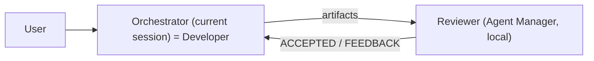

### Worktree mode architecture

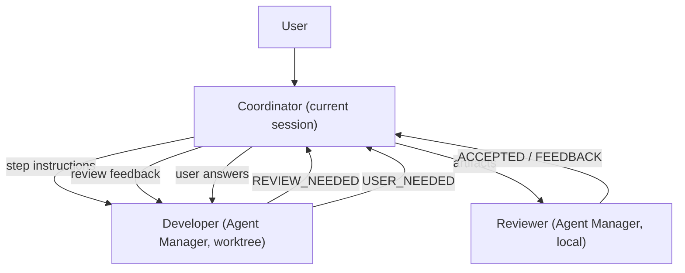

Constraint: Agent Manager subagents cannot spawn their own subagents. In worktree mode, the coordinator must spawn both developer and reviewer, and handle all routing.

## Architecture (direct mode)

Single-session model. The orchestrator runs in the current session as the developer and spawns one reviewer via Agent Manager.

- **Current session**: developer. All code reading, writing, building, testing.
- **Reviewer**: Agent Manager subagent (mode: "local"). Spawned at Step 0, stopped at Step 8 or abort.

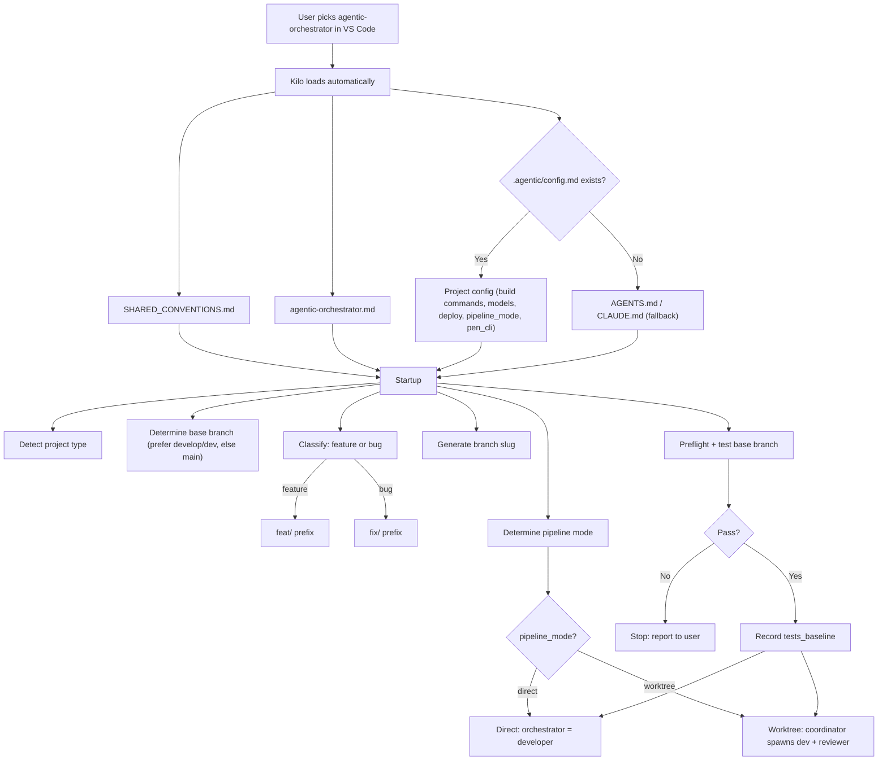

## Feature pipeline

```mermaid
flowchart TD
    S0["S0: Initialize"]
    S0 --> S0p{"Preflight OK?"}
    S0p -- No --> STOP["Stop: report to user"]
    S0p -- Yes --> S0t{"Base tests pass?"}
    S0t -- No --> STOP
    S0t -- Yes --> S0m{"pipeline_mode?"}
    S0m -- direct --> S0d["Create branch + task dir + spawn reviewer + state.md"]
    S0m -- worktree --> S0w["Create branch + task dir + spawn developer worktree + discover worktree_path + spawn reviewer + state.md"]
    S0d --> S1
    S0w --> S1

    S1["S1: Requirement"]
    S1 --> |"Explore codebase"| S1a["Ask user if unclear"]
    S1a --> |"USER clarifies"| S1b["Write requirement.md"]
    S1b --> S2

    S2["S2: Design decisions"]
    S2 --> S2r["Reviewer: feasibility filter"]
    S2r --> S2u["USER: choose option"]
    S2u --> S2w["Write design-decisions.md"]
    S2w --> UI{"UI changes?"}
    UI -- Yes --> S25
    UI -- No --> S3

    S25["S2.5: UI mock"]
    S25 --> S25p["Read pen_cli from config"]
    S25p --> S25g["Generate mock.pen + mock-preview.png via pen_cli"]
    S25g --> S25r["Reviewer reviews mock (max 10)"]
    S25r --> S25u["USER: approve mock"]
    S25u --> S3

    S3["S3: Plan + DoD"]
    S3 --> S3w["Write plan.md + definition-of-done.md"]
    S3w --> S3r["Reviewer reviews plan (max 10)"]
    S3r --> S35

    S35["S3.5: Test plan"]
    S35 --> S35w["Write test-plan.md"]
    S35w --> S35r["Reviewer reviews coverage (max 10)"]
    S35r --> S4

    S4["S4: Implementation"]
    S4 --> S4i["Write code + tests"]
    S4i --> S4b["Run build gate (preflight, build, test, lint, fmt)"]
    S4b --> S4c["Commit + build-latest.log"]
    S4c --> S4v{"Clean tree outside .agentic-tasks/?"}
    S4v -- No --> S4b
    S4v -- Yes --> S5

    S5["S5: Code + test review"]
    S5 --> S5r["Reviewer reads git diff + build-latest.log"]
    S5r --> |"FEEDBACK"| S5f["Fix + rebuild + new log"]
    S5f --> S5r
    S5r --> |"ACCEPTED"| S6

    S6["S6: DoD verification"]
    S6 --> S6r["Reviewer checks each DoD item against source"]
    S6r --> |"Items missing"| S5
    S6r --> |"All pass"| S7

    S7["S7: User acceptance"]
    S7 --> S7t["Present summary + diff + build results"]
    S7t --> S7u["USER tests on device"]
    S7u --> R{"Result"}
    R -- "New bug (this ticket)" --> SUB["Bug-fix sub-pipeline"]
    R -- "Code bug (simple)" --> S5
    R -- "Design flaw" --> S3
    R -- "Abort" --> ABT["Abort path"]
    R -- "Confirmed" --> S8

    SUB --> |"After fix"| S7u

    S8["S8: Merge + cleanup"]
    S8 --> S8a["Pull latest base branch"]
    S8a --> S8m["Merge base into feature (resolve conflicts)"]
    S8m --> S8r["Rebuild + retest"]
    S8r --> S8c["Reviewer reviews conflicts"]
    S8c --> S8p["USER: confirm push"]
    S8p --> S8g["Merge --no-ff + push"]
    S8g --> S8l["Review rules lifecycle (read final-summary.md)"]
    S8l --> S8s["Stop reviewer"]
    S8w["worktree only: git worktree remove"] --> S8l
    S8s --> S8w2["Write final-summary.md"]
```

## Bug pipeline

Replaces S2 (design) with S1.5 (reproduction).

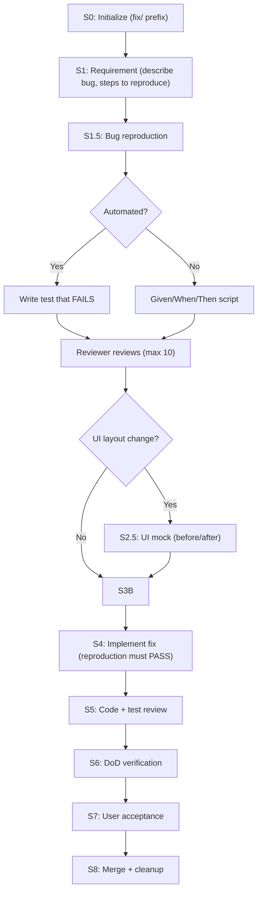

## Bug-fix sub-pipeline (within S7)

When user finds a bug during device testing:

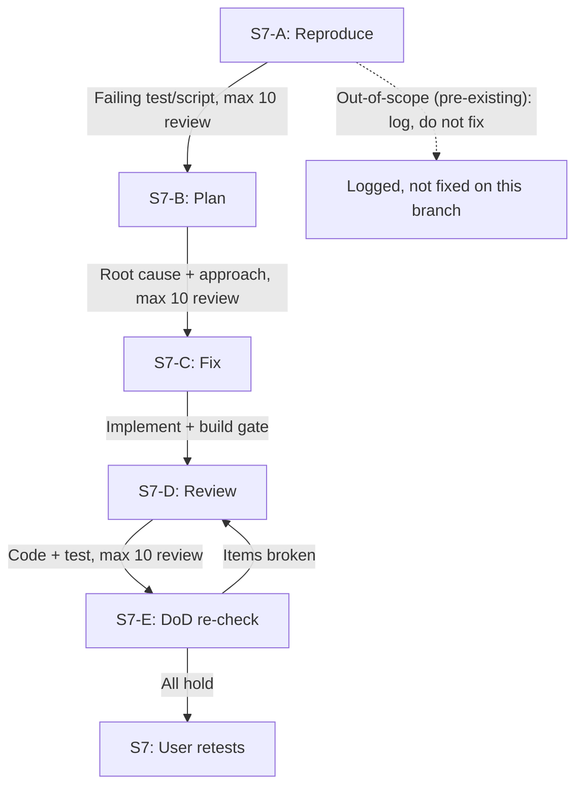

Out-of-scope bugs (pre-existing) are logged but not fixed on the ticket branch.

## Review severity levels

Five levels, three behaviors. Gates: BLOCKING through HIGH gate the pipeline. MEDIUM and SUGGESTION never gate.

| Severity | Gates? | Action |
|----------|--------|--------|
| BLOCKING | Yes | Fix now. Pipeline cannot proceed: build broken, artifact missing, wrong branch, no tests run. |
| CRITICAL | Yes | Fix now. Security issue, data loss risk, broken core invariant. |
| HIGH | Yes | Fix now. Significant correctness or design concern. |
| MEDIUM | No | Log to iterations/N-review.md. Fix if cheap. |
| SUGGESTION | No | Log only. |

No sweep rule: a blocking fix must be minimal and targeted, not bundled with unrelated changes.

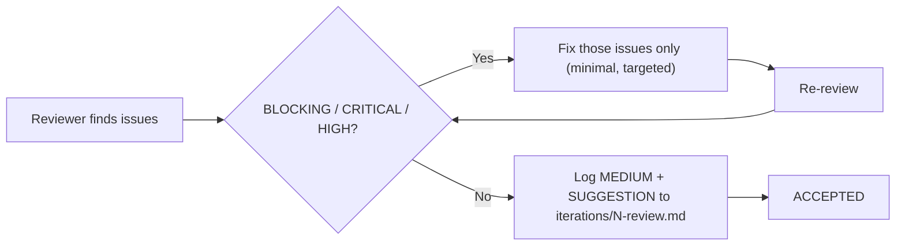

When resolving feedback, fix BLOCKING/CRITICAL/HIGH issues only. A blocking fix must be minimal and targeted, not bundled with unrelated changes. MEDIUM issues are logged and fixed if cheap. SUGGESTION is logged only.

## Iteration limits

- **Per-loop cap**: 10 iterations per review loop
- **Global cap**: 50 iterations across all loops combined
- `global_iterations` increments after every review cycle
- Limits are **per-pipeline** (per task/branch). When running multiple parallel pipelines (worktree mode), each has its own independent budget. A coordinator must never sum iterations across branches.

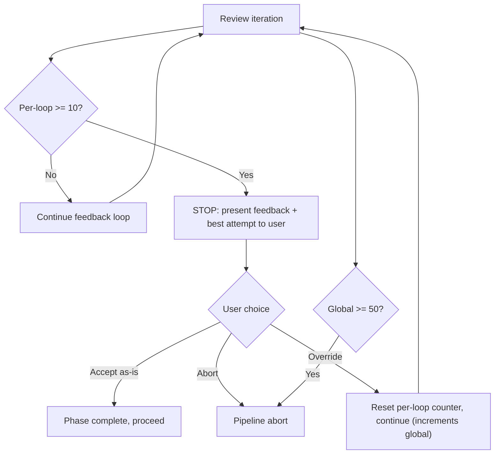

Global cap hit: unconditional abort.

## Iteration counters

Tracked in state.md per ticket (used as pipeline cost metric, not tokens):

```yaml
phase_iterations:
  bug_repro: 0
  bug_plan: 0
  bug_code: 0
  mock: 0
  plan: 0
  test_plan: 0
  code: 0
```

## Gating checkpoints

| Gate | Where | What checks |
|------|-------|-------------|
| Build gate | S4 exit | preflight, build, test, lint, fmt check all pass |
| Gitleaks | S4 commit | No hardcoded secrets in diff |
| Clean tree | S4 exit | No untracked/modified outside .agentic-tasks/ |
| Reviewer ACCEPTED | Every review step | No BLOCKING, CRITICAL, or HIGH issues (MEDIUM and SUGGESTION do not gate) |
| DoD verification | S6 | Every DoD item verified in actual source |
| Phase gate | Every transition | Cannot skip phases |
| Push confirmation | S8 | User must confirm before git push |
| Global cap | Any point | Pipeline aborts unconditionally at 50 iterations |

## Review rules lifecycle (Step 8)

Only runs if `docs/REVIEW_RULES.md` or `.agentic/review_rules.md` exists:

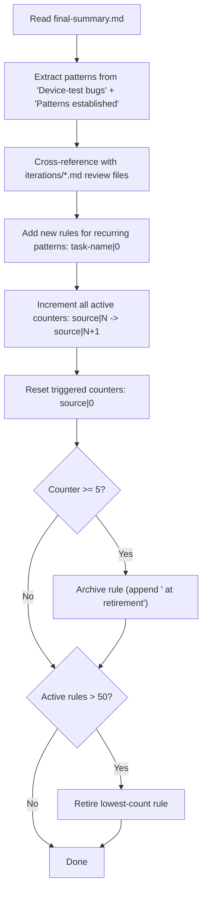

## Final summary (final-summary.md)

Template: `~/.config/kilo/agent/task-template/final-summary.md`

Every number must be measured, not estimated:

<!-- Commands used to populate summary fields: -->
<!--   Commits:          git rev-list --count <base>..<branch> -->
<!--   Files/lines:     git diff --stat <base>..<branch> -->
<!--   Tests before:    tests_baseline from state.md (captured at Step 0 on base branch) -->
<!--   Tests after:     TOTAL PASSED from build-latest.log -->
<!--   Tree clean:      git status --porcelain -- ':!.agentic-tasks' -->

| Field | Source |
|-------|--------|
| Files/lines | git diff --stat |
| Commits | git rev-list --count |
| Tests before | state.md tests_baseline |
| Tests after | build-latest.log TOTAL PASSED |
| Iterations | phase_iterations from state.md |
| Elapsed | state.md started_at -> phase_log last entry |
| Tree clean at merge | git status --porcelain -- ':!.agentic-tasks' empty? |

No token counts. Kilo does not expose a session token counter.

Key sections:
- **User-facing changes** - what shipped (readable six months later)
- **Device-test bugs found and fixed** - root cause + fix per bug
- **Patterns established** - reusable patterns introduced
- **Pipeline cost** - iterations (not tokens) + elapsed time
- **Per-phase elapsed** - computed from phase_log
- **Ticket limitations** - scoped to this ticket, not project-wide facts

## Worktree mode details

### Artifact ownership

The coordinator owns the task directory (in the main working directory, NOT the worktree). The developer never writes to the task directory. All artifacts are written by the coordinator from relayed signal content.

| Artifact | Written by | How |
|----------|-----------|-----|
| state.md | Coordinator | On every phase transition |
| requirement.md | Coordinator | From S1 USER_NEEDED or STEP_COMPLETE content |
| design-decisions.md | Coordinator | From S2 USER_NEEDED or STEP_COMPLETE content |
| mock.md, mock.pen, mock-preview.png | Developer (in worktree) | Generated in worktree; coordinator copies from worktree path to task directory |
| plan.md | Coordinator | From S3 REVIEW_NEEDED content |
| definition-of-done.md | Coordinator | Extracted from plan.md by coordinator |
| test-plan.md | Coordinator | From S3.5 REVIEW_NEEDED content |
| bug-reproduction.md | Coordinator | From S1.5 REVIEW_NEEDED content |
| build-latest.log | Coordinator | From S4 BUILD_RESULT content |
| iterations/N-review.md | Coordinator | From reviewer feedback |
| iterations/N-response.md | Coordinator | From developer signal after feedback |
| final-summary.md | Coordinator | After merge |

For mock files: the developer generates them in the worktree. The coordinator reads them from the worktree path and copies into the task directory. One-way access: coordinator can read the worktree, developer cannot reach the main directory.

### Coordinator instruction pattern

The coordinator sends each step's definition one at a time. The developer has no pipeline steps upfront.

For each step, the coordinator sends:
1. The step definition (from the relevant Pipeline section)
2. Context from previous steps (approved design decisions, accepted plan)
3. Signal format reminder

Wait for signal, process, proceed to next step.

### Developer signals

| Signal | When | Content |
|--------|------|---------|
| REVIEW_NEEDED | Artifact ready for review | Step ID + artifact content inline in code block |
| USER_NEEDED | User decision needed | Step ID + question or options |
| STEP_COMPLETE | Step finished | Step ID only |
| BUILD_RESULT | Build finished | Pass/fail + build-latest.log content inline |

### Reviewer access

In worktree mode, the reviewer reads source files from the worktree path (passed in initial prompt). For code reviews, the coordinator also relays the git diff inline from the developer.

### Multiple pipelines

Each worktree session runs independently until it hits a user gate. Device testing is sequential (one binary, one Kobo). Non-device tickets can run fully in parallel.

## UI mock workflow (Step 2.5)

Read `pen_cli` from `.agentic/config.md` for the binary name (default: `pen`). Requires `pen login` or `PEN_CLI_KEY` env var. PEN_CLI_KEY must only exist in the user environment, never committed to git.

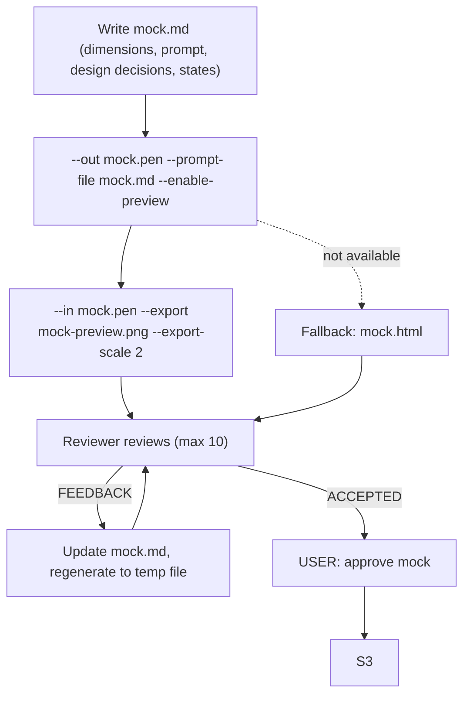

On feedback, regenerate to temp file to avoid truncation:
```
<pen_cli> --in mock.pen --out mock.new.pen --prompt-file mock.md
Move-Item -Force mock.new.pen mock.pen
<pen_cli> --in mock.pen --export mock-preview.png --export-scale 2
```

Note: agent_manager prompts may not support image attachments. If the reviewer cannot see the PNG, send mock.md (prose) only and defer visual review to user approval.

## Abort path

1. Stop reviewer Agent Manager session (direct mode) or both developer + reviewer sessions (worktree mode)
2. In worktree mode: `git worktree remove <worktree-path>` (must happen before branch delete; git refuses to delete a branch checked out in a worktree)
3. `git checkout <base_branch>` then `git branch -D <branch>`
4. Write state.md with phase = ABORTED
5. Write final-summary.md

## Restart after interruption

Read `.agentic-tasks/<branch>/state.md`:

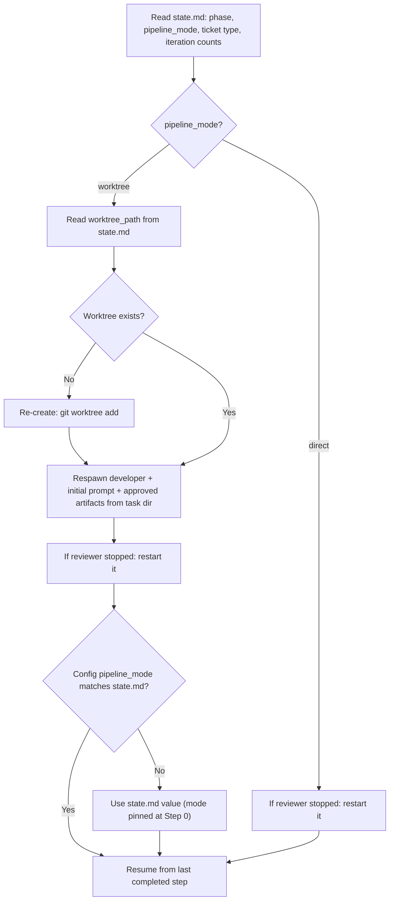

Mode is fixed at Step 0 and cannot be changed mid-ticket. state.md wins over config.md.

## Template locations

```
~/.config/kilo/agent/task-template/    (global, generic)
  state.md
  requirement.md
  design-decisions.md
  plan.md
  test-plan.md
  bug-reproduction.md
  definition-of-done.md
  build-latest.log
  mock.md                    (Pencil prompt context)
  iteration-template.md
  final-summary.md

.agentic/task-template/               (project-specific only)
  mock.md                  (1264x1680 Kobo device dimensions, e-ink considerations)
  definition-of-done.md (project DoD items: cross build, audio sync)
```

## Task directory structure

```
.agentic-tasks/<branch-slug>/
  state.md
  requirement.md
  design-decisions.md        (features only)
  mock.md                    (UI features only, Pencil context)
  mock.pen                   (UI features only, generated by Pencil)
  mock-preview.png           (UI features only, exported from Pencil)
  plan.md
  test-plan.md
  bug-reproduction.md         (bugs only)
  definition-of-done.md
  build-latest.log
  merge-verify-build.log
  iterations/
    N-review.md              (reviewer feedback)
    N-response.md            (developer response to feedback)
  final-summary.md
```

## State file format

```yaml
phase: S4
type: feature
pipeline_mode: direct        # or: worktree
worktree_path: null          # worktree mode only
global_iterations: 2
tests_baseline: 336
phase_iterations:
  bug_repro: 0
  bug_plan: 0
  bug_code: 0
  mock: 0
  plan: 1
  test_plan: 0
  code: 0
branch: feat-word-list-flow
base_branch: develop
branch_created: true
started_at: 2026-07-31T00:00:00Z
updated: 2026-07-31T00:00:00Z
phase_log:
  - phase: S0
    entered_at: 2026-07-31T00:00:00Z
  - phase: S1
    entered_at: 2026-07-31T00:05:00Z
  - phase: S2
    entered_at: 2026-07-31T00:12:00Z
  - phase: S3
    entered_at: 2026-07-31T00:20:00Z
  - phase: S4
    entered_at: 2026-07-31T00:30:00Z
```
