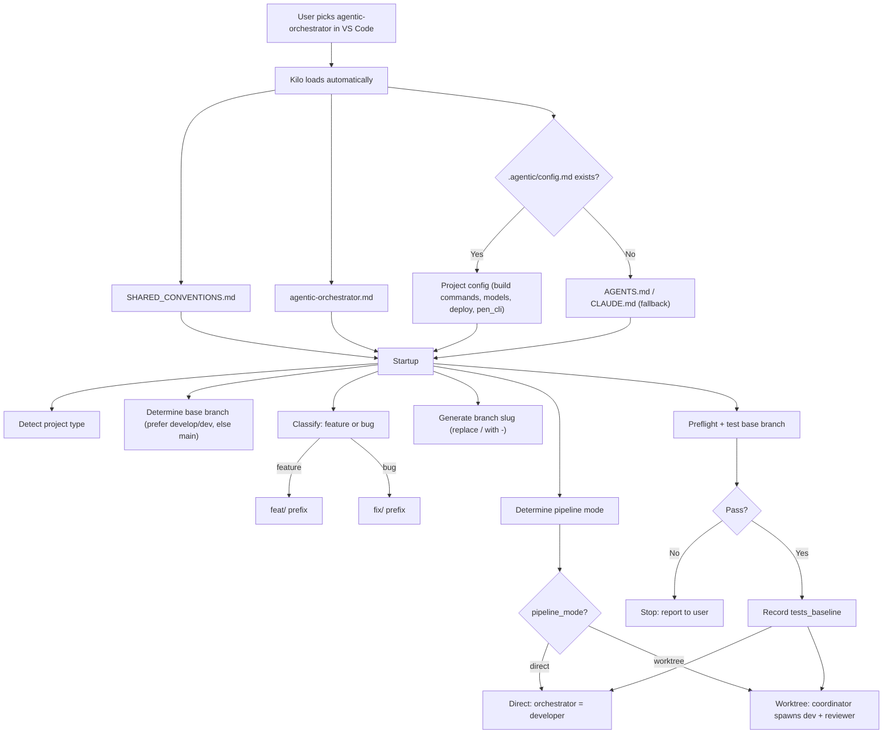
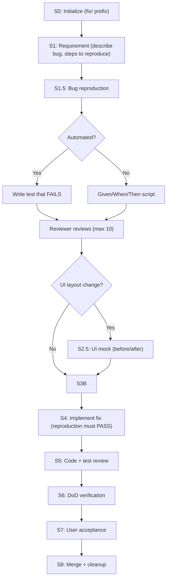
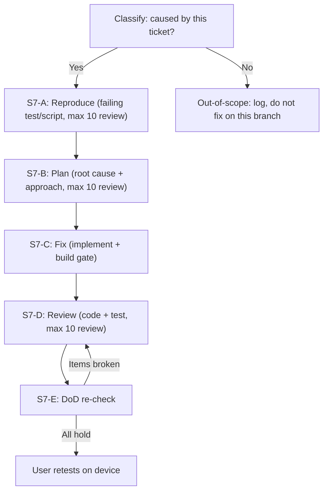
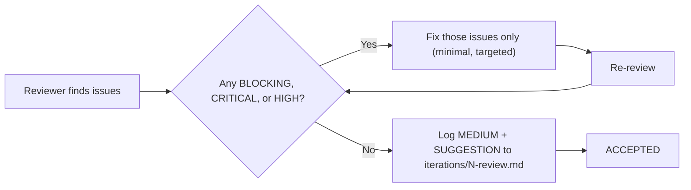
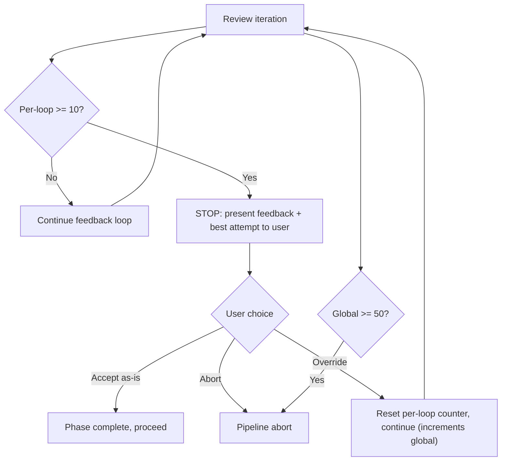
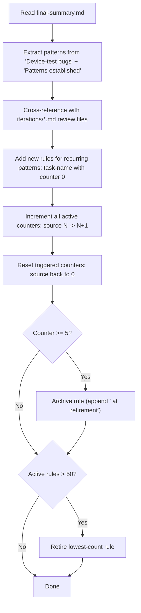
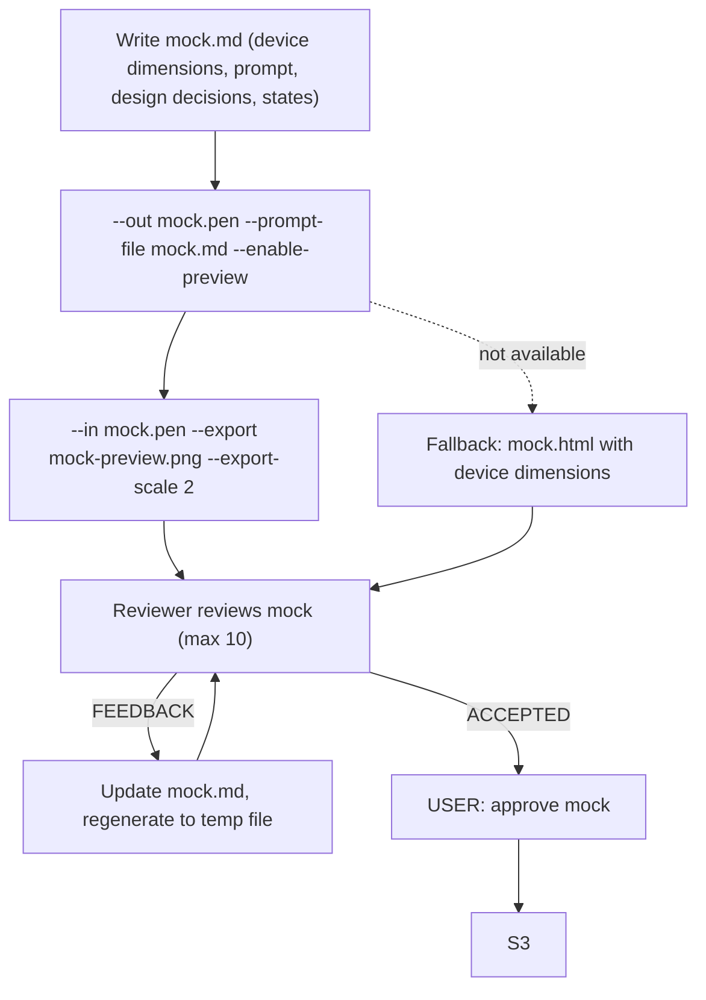
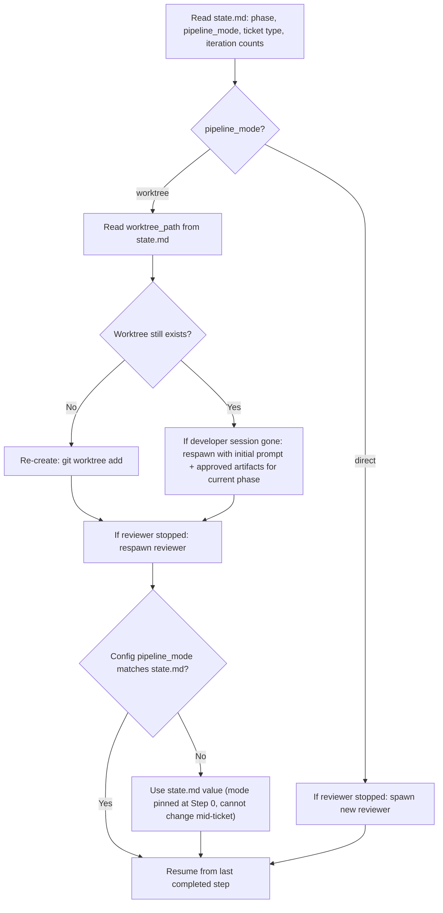

# Agentic Pipeline Reference

Current implementation as of 2026-07-31. This document describes how the agentic pipeline works. For the executable instructions, see the source of truth files listed below.

## Source of truth

The pipeline is defined across several files. When they disagree, this priority order applies:

| Priority | File | Scope |
|----------|------|-------|
| 1 (highest) | `.agentic/config.md` | Build commands, model IDs, deploy instructions |
| 2 | `.agentic/orchestrator.md` | Project-specific overrides (build gate format, device test, git ops) |
| 3 | `~/.config/kilo/agent/agentic-orchestrator.md` | Full pipeline flow, step definitions, relay protocol |
| 4 | `.agentic/reviewer.md` | Severity spec, gate rules, review checklist |
| 5 | `~/.config/kilo/SHARED_CONVENTIONS.md` | Commit style, AI cleanup, secrets, severity table |
| 6 | `docs/REVIEW_RULES.md` | Auto-growing rule set (read by reviewer every iteration) |
| 7 (lowest) | `AGENTS.md` | Project-wide facts, device constraints, build/deploy commands |

Templates live in two locations. Project templates override global templates when both exist:

| Location | Purpose | Example contents |
|----------|---------|-----------------|
| `~/.config/kilo/agent/task-template/` | Generic, project-agnostic | state.md, plan.md, final-summary.md |
| `.agentic/task-template/` | Project-specific only | mock.md (Kobo dimensions), definition-of-done.md (cross build) |

## What the pipeline does

The pipeline takes a user request ("add word list selection" or "fix scrollbar regression") and produces a merged, tested, reviewed change on the develop branch. It handles the full lifecycle: understanding the requirement, making design decisions, planning the implementation, writing code, getting it reviewed, verifying it does what was promised, and merging it.

Two pipeline types:
- **Feature**: new behavior. Flows through design decisions, optional UI mock, plan, test plan, implementation, review, DoD check, user test, merge.
- **Bug fix**: broken behavior. Replaces design decisions with a reproduction step (write a failing test first), then root cause analysis, then fix.

## Pipeline modes

The pipeline runs in one of two modes. Direct is the default. Worktree activates when the user's command mentions worktree, parallel work, or multiple tickets.

### Direct mode (default)

The orchestrator IS the developer. Everything happens in the current VS Code session: reading code, writing code, running builds, committing. One reviewer subagent is spawned for review steps.

```
User request -> [Orchestrator (current session) = Developer] --artifacts--> [Reviewer (Agent Manager)]
               <- feedback - - - - - - - - - - - - - - - - - - <- ACCEPTED/FEEDBACK
```

Use this for single tickets. Simpler, lower latency, full file access.

### Worktree mode

The orchestrator becomes a coordinator. It spawns two Agent Manager sessions -- a developer in an isolated git worktree and a reviewer in the local session -- and relays between them and the user. The coordinator does not write code.

```
                      [Developer (worktree)] --REVIEW_NEEDED--> [Coordinator]
[User] ---USER_NEEDED->                                                        |
                      [Reviewer (local)] --ACCEPTED/FEEDBACK-->             |
                       <--artifacts/review feedback--                   |
```

Use this for parallel work on multiple tickets. Each ticket gets its own worktree and reviewer. The coordinator presents pending user gates in order.

Constraint: Agent Manager subagents cannot spawn their own subagents. The coordinator must spawn both sessions and handle all routing. Device testing is still sequential (one binary, one Kobo).

### How mode is chosen

At startup, the pipeline inspects the user's command/request. If it mentions worktree, parallel work, multiple tickets, or similar terms, the pipeline uses worktree. Otherwise, it defaults to direct. No config field controls this -- it's detected from the prompt.

**Mode is fixed at Step 0.** Once the pipeline starts, `pipeline_mode` is written to `state.md`. If someone edits `config.md` mid-ticket, the pipeline ignores the change and uses the `state.md` value. This prevents a silent architecture switch during a resumed session.

## Startup sequence



At startup, the pipeline:
1. Reads project config (`.agentic/config.md`) or falls back to `AGENTS.md`/`CLAUDE.md`
2. Auto-detects project type from file structure (Cargo.toml, package.json, etc.)
3. Determines the base branch (prefers `develop`/`dev`, else `main`)
4. Classifies the ticket as feature or bug (sets branch prefix: `feat/` or `fix/`)
5. Generates a branch slug (replace `/` with `-`, e.g. `feat/word-list-flow` becomes `feat-word-list-flow`)
6. Reads `pipeline_mode` from config
7. Reads model IDs: `reviewer_id` + `reviewer_variant` for the reviewer, `developer_id` + `developer_variant` for worktree mode
8. Runs preflight, then tests the base branch, and records the test baseline

### Step 0: Initialize

This is the shared entry point. Steps 1-4 are the same in both modes. Steps 5+ differ.

**Shared (all modes):**
1. Run preflight. If it fails, stop and report to the user.
2. Run the test command on the base branch. If tests fail, stop. A red base branch means every downstream test delta is unreliable. Do not record a failing baseline.
3. If tests pass, parse TOTAL PASSED and record it as `tests_baseline`. This is the pre-ticket baseline for measuring test regressions.
4. Create the feature branch from the base branch.

**Direct mode (steps 5-7):**
5. Create the task directory `.agentic-tasks/<branch-slug>/` and copy templates into it.
6. Spawn the reviewer via Agent Manager.
7. Write `state.md` with `started_at`, `tests_baseline`, `pipeline_mode: direct`, and the S0 phase_log entry.

**Worktree mode (steps 5-9):**
5. Create the task directory in the main working directory (NOT the worktree). Copy templates.
6. Spawn the developer worktree via Agent Manager.
7. Discover the worktree path via `git worktree list`. Hold in memory (state.md not yet created).
8. Spawn the reviewer via Agent Manager.
9. Write `state.md` with `started_at`, `tests_baseline`, `pipeline_mode: worktree`, `worktree_path`, and the S0 phase_log entry.

## Feature pipeline

```mermaid
flowchart TD
    S0["S0: Initialize"]
    S0 --> S0p{"Preflight OK?"}
    S0p -- No --> STOP["Stop: report to user"]
    S0p -- Yes --> S0t{"Base tests pass?"}
    S0t -- No --> STOP
    S0t -- Yes --> S0m{"pipeline_mode?"}
    S0m -- direct --> S0d["Create branch + task dir + spawn reviewer + state.md"]
    S0m -- worktree --> S0w["Create branch + task dir + spawn developer worktree + discover worktree_path + spawn reviewer + state.md"]
    S0d --> S1
    S0w --> S1

    S1["S1: Requirement"]
    S1 --> |"Explore codebase"| S1a["Ask user if unclear"]
    S1a --> |"USER clarifies"| S1b["Write requirement.md"]
    S1b --> S2

    S2["S2: Design decisions"]
    S2 --> S2r["Reviewer: feasibility filter"]
    S2r --> S2u["USER: choose option"]
    S2u --> S2w["Write design-decisions.md"]
    S2w --> UI{"UI changes?"}
    UI -- Yes --> S25
    UI -- No --> S3

    S25["S2.5: UI mock"]
    S25 --> S25p["Read pen_cli from config"]
    S25p --> S25g["Generate mock.pen + mock-preview.png via pen_cli"]
    S25g --> S25r["Reviewer reviews mock (max 10)"]
    S25r --> S25u["USER: approve mock"]
    S25u --> S3

    S3["S3: Plan + DoD"]
    S3 --> S3w["Write plan.md + definition-of-done.md"]
    S3w --> S3r["Reviewer reviews plan (max 10)"]
    S3r --> S35

    S35["S3.5: Test plan"]
    S35 --> S35w["Write test-plan.md"]
    S35w --> S35r["Reviewer reviews coverage (max 10)"]
    S35r --> S4

    S4["S4: Implementation"]
    S4 --> S4i["Write code + tests"]
    S4i --> S4b["Run build gate (preflight, build, test, lint, fmt)"]
    S4b --> S4c["Commit + build-latest.log"]
    S4c --> S4v{"Clean tree outside .agentic-tasks/?"}
    S4v -- No --> S4b
    S4v -- Yes --> S5

    S5["S5: Code + test review"]
    S5 --> S5r["Reviewer reads git diff + build-latest.log"]
    S5r --> |"FEEDBACK"| S5f["Fix + rebuild + new log"]
    S5f --> S5r
    S5r --> |"ACCEPTED"| S6

    S6["S6: DoD verification"]
    S6 --> S6r["Reviewer checks each DoD item against source"]
    S6r --> |"Items missing"| S5
    S6r --> |"All pass"| S7

    S7["S7: User acceptance"]
    S7 --> S7t["Present summary + diff + build results"]
    S7t --> S7u["USER tests on device"]
    S7u --> R{"Result"}
    R -- "New bug (this ticket)" --> SUB["Bug-fix sub-pipeline"]
    R -- "Code bug (simple)" --> S5
    R -- "Design flaw" --> S3
    R -- "Abort" --> ABT["Abort path"]
    R -- "Confirmed" --> S8

    SUB --> |"After fix"| S7u

    S8["S8: Merge + cleanup"]
    S8 --> S8a["Pull latest base branch"]
    S8a --> S8m["Merge base into feature (resolve conflicts)"]
    S8m --> S8r["Rebuild + retest"]
    S8r --> S8c["Reviewer reviews conflicts"]
    S8c --> S8p["USER: confirm push"]
    S8p --> S8g["Merge --no-ff + push"]
    S8g --> S8l["Review rules lifecycle (read final-summary.md)"]
    S8l --> S8s["Stop reviewer"]
    S8w["worktree only: git worktree remove"] --> S8l
    S8s --> S8w2["Write final-summary.md"]
```



### Step-by-step walkthrough

**S1: Requirement.** The developer reads the codebase to understand the request, asks the user clarifying questions if needed, and writes `requirement.md`. The output is a clear, unambiguous description of what the ticket should deliver.

**S2: Design decisions.** The developer researches implementation options, sends them to the reviewer for feasibility filtering (the reviewer reads actual source to verify claims), then presents the feasible options to the user. The user chooses. The chosen decisions are written to `design-decisions.md`. If the ticket involves UI changes, the pipeline routes to S2.5 next; otherwise, straight to S3.

**S2.5: UI mock.** Only for tickets with UI changes. The developer writes `mock.md` describing the screens, device dimensions, interactive states, and approved design decisions. The Pencil CLI (`pen_cli` from config, default `pen`) generates `mock.pen` and a preview PNG. The reviewer checks the mock against the design decisions and device viewport. After reviewer acceptance, the user sees the mock and approves it visually before any code is written. If Pencil is unavailable, falls back to `mock.html`.

**S3: Plan + DoD.** The developer writes `plan.md` with architecture, files to change, risks, and the definition of done (DoD). The DoD is extracted into `definition-of-done.md`. The reviewer checks the plan against actual source code. Each DoD item must have a pass/fail criterion.

**S3.5: Test plan.** The developer writes `test-plan.md` with test scenarios (no code, just descriptions). The reviewer checks coverage completeness: happy path, edge cases, device-specific risks.

**S4: Implementation.** The developer writes code and tests, runs the build gate (preflight, build, test, lint, fmt check), fixes all errors, commits, and dumps `build-latest.log`. The tree must be clean outside `.agentic-tasks/`. The build log records the HEAD SHA, tree status, and TOTAL PASSED count.

**S5: Code + test review.** The reviewer reads the full git diff and `build-latest.log`. Feedback loops up to 10 iterations per review step. Only BLOCKING, CRITICAL, and HIGH issues must be fixed; MEDIUM and SUGGESTION never gate.

**S6: DoD verification.** The reviewer reads actual source files and checks every item in `definition-of-done.md`. If items are missing, the pipeline routes back to S5.

**S7: User acceptance.** The pipeline presents a summary, diff, and build results to the user. The user deploys to the device and tests. Feedback routes:
- New bug caused by this ticket -> bug-fix sub-pipeline (S7-A through S7-E)
- Simple code bug -> back to S5
- Design flaw -> back to S3 (replan)
- Abort -> abort path
- Confirmed -> S8

**S8: Merge + cleanup.** Pull latest base, merge base into feature (resolve conflicts), rebuild + retest, reviewer reviews conflicts, user confirms push, merge with `--no-ff`, run review rules lifecycle, stop sessions, write `final-summary.md`. In worktree mode, `git worktree remove` happens after stopping sessions but before any branch delete.

## Bug pipeline

Bug tickets follow the same structure but replace S2 (design decisions) with S1.5 (reproduction). After S1.5 acceptance, if the fix changes UI layout or interaction, it routes through S2.5 (mock) before S3 -- this captures the before/after layout so the user can approve the visual change before code is written.



### S1.5: Bug reproduction

The developer writes a reproduction artifact based on bug type:

| Bug type | Reproduction | Automated? |
|----------|-------------|------------|
| Logic/state | Unit test that FAILS | Yes |
| API/contract | Integration test that FAILS | Yes |
| Component state | Framework test (e.g., i-slint-backend-testing) | Yes |
| Layout/geometry | Framework test asserting element geometry | Yes |
| Rendering | Screenshot test vs expected output | Yes |
| Touch/interaction | Framework test simulating input events | Yes |
| Animation/timing | Given/When/Then script | No |
| Hardware-dependent (e-ink, frontlight, sleep) | Given/When/Then script | No |

For automated: write a test that currently FAILS. Do NOT fix the bug yet. The reviewer checks that the test actually reproduces the bug, is isolated, and is realistic.

For manual: write `bug-reproduction.md` with exact preconditions, steps, expected vs actual result, and acceptance criteria.

### S3: Root cause + fix plan (bug pipeline)

After S1.5 acceptance (and optional S2.5 mock), the developer writes `plan.md` with root cause analysis pointing to a specific `file:line`, the fix approach, side effects, out-of-scope items, and DoD. The reviewer checks that the root cause matches the reproduction and the fix is minimal and targeted.

### S4: Implement fix

The reproduction test must now PASS. For manual reproductions, the fix logic must address each step in `bug-reproduction.md`. Build gate runs, commit, build-latest.log dumped.

## Bug-fix sub-pipeline (within S7)

When the user finds a new bug during device testing that was caused by this ticket's changes:



Pre-existing bugs are logged but never fixed on the ticket branch. Finish the current pipeline first.

## Review severity levels

Five severity levels, three behaviors:

| Severity | Gates? | When to use | Action |
|----------|--------|-------------|--------|
| BLOCKING | Yes | Build broken, artifact missing, wrong branch, no tests run | Fix now. |
| CRITICAL | Yes | Security issue, data loss risk, broken core invariant | Fix now. |
| HIGH | Yes | Significant correctness or design concern | Fix now. |
| MEDIUM | No | Test gap, minor design issue, non-critical improvement | Log. Fix if cheap. Does not gate. |
| SUGGESTION | No | Style, naming, minor clarity improvement | Log only. Does not gate. |



Key rules:
- No sweep rule. A blocking fix must be minimal and targeted, not bundled with unrelated changes.
- MEDIUM and SUGGESTION never prevent acceptance. They are logged, and fixed only if cheap.
- The reviewer responds with exactly one word: `ACCEPTED` or `FEEDBACK`. Never both.
- When the project has `.agentic/reviewer.md`, it owns the severity spec and gate rules. The inline fallback only applies to projects without one.

## Iteration limits

| Limit | Value | Scope |
|-------|-------|-------|
| Per-loop cap | 10 iterations | Per review step (mock, plan, test plan, code, etc.) |
| Global cap | 50 iterations | Per pipeline (per task/branch) |

When a per-loop cap is hit, the pipeline stops the feedback loop and presents the remaining feedback plus the best attempt to the user. The user chooses:
1. **Accept as-is** -- phase marked complete, proceed
2. **Abort** -- full pipeline abort
3. **Override** -- reset the per-loop counter to 0, continue (increments global)

When the global cap (50) is hit, the pipeline aborts unconditionally. No user override.

Limits are per-pipeline. When running multiple parallel pipelines in worktree mode, each has its own independent budget in its own `state.md`. A coordinator must never sum iterations across branches.



## Iteration counters

Tracked in `state.md` per ticket. These are used as the pipeline cost metric (not tokens, since Kilo does not expose a token counter):

```yaml
phase_iterations:
  bug_repro: 0    # S1.5 reviews (features: always 0)
  bug_plan: 0     # S7-B plan reviews (features: always 0)
  bug_code: 0     # S7-D code reviews (features: always 0)
  mock: 0         # S2.5 mock reviews
  plan: 0         # S3 plan reviews
  test_plan: 0    # S3.5 test plan reviews
  code: 0         # S5 code review iterations
```

## Gating checkpoints

| Gate | Where | What it checks | Fails if |
|------|-------|---------------|----------|
| Preflight | S0 | Docker running (or whatever preflight command is) | Preflight command exits non-zero |
| Baseline tests | S0 | Base branch tests pass | Tests fail on base branch |
| Build gate | S4 exit | preflight, build, test, lint, fmt check all pass | Any command fails |
| Gitleaks | S4 commit | No hardcoded secrets in diff | Gitleaks finds a match |
| Clean tree | S4 exit | No untracked/modified outside `.agentic-tasks/` | Dirty tree |
| Reviewer ACCEPTED | Every review step | No BLOCKING, CRITICAL, or HIGH issues | Any gating severity found |
| DoD verification | S6 | Every DoD item verified in actual source | Item not met |
| Phase gate | Every transition | Phases cannot be skipped | Attempt to jump ahead |
| Push confirmation | S8 | User must explicitly confirm before `git push` | Skipped |
| Global cap | Any point | Pipeline aborts at 50 iterations | Budget exhausted |

## Review rules lifecycle (Step 8)

After merging, the pipeline reads `final-summary.md` and extracts feedback patterns. If the same feedback recurred across review iterations, a new rule is added to `docs/REVIEW_RULES.md`. This is how the reviewer gets smarter over time.



The reviewer reads only the active rules each iteration. Archived rules are kept for reference but not checked.

## Final summary (final-summary.md)

Written at Step 8 using the template at `~/.config/kilo/agent/task-template/final-summary.md`. Every number must be measured from a real command, not estimated:

| Field | Command |
|-------|---------|
| Commits | `git rev-list --count <base>..<branch>` |
| Files/lines | `git diff --stat <base>..<branch>` |
| Tests before | `tests_baseline` from `state.md` (captured at S0 on base branch) |
| Tests after | `TOTAL PASSED` from `build-latest.log` |
| Tree clean | `git status --porcelain -- ':!.agentic-tasks'` |
| Iterations | `phase_iterations` from `state.md` |
| Elapsed | `started_at` -> last `phase_log` entry from `state.md` |

No token counts. Kilo does not expose a session token counter, so any token number would be fabricated. Iteration counts from `state.md` are the cost metric instead.

Key sections in the summary:
- **User-facing changes** -- what shipped (readable six months later)
- **Device-test bugs found and fixed** -- root cause (specific file:line) and fix per bug
- **Patterns established** -- reusable patterns introduced
- **Pipeline cost** -- iterations + elapsed time
- **Per-phase elapsed** -- computed from `phase_log` entries
- **Ticket limitations** -- what this ticket left undone (scoped to this ticket, not project-wide)

## Worktree mode details

### Artifact ownership

In worktree mode, the task directory lives in the main working directory (NOT the worktree). The coordinator owns it and writes all artifacts. The developer never writes to the task directory.

| Artifact | Written by | How |
|----------|-----------|-----|
| state.md | Coordinator | On every phase transition |
| requirement.md | Coordinator | From developer's S1 signal content |
| design-decisions.md | Coordinator | From developer's S2 signal content |
| mock.md, mock.pen, mock-preview.png | Developer (in worktree) | Generated in worktree; coordinator reads from worktree path and copies to task dir |
| plan.md | Coordinator | From developer's S3 REVIEW_NEEDED signal |
| definition-of-done.md | Coordinator | Extracted from plan.md by coordinator |
| test-plan.md | Coordinator | From developer's S3.5 signal |
| bug-reproduction.md | Coordinator | From developer's S1.5 signal |
| build-latest.log | Coordinator | From developer's S4 BUILD_RESULT signal |
| iterations/N-review.md | Coordinator | From reviewer feedback |
| iterations/N-response.md | Coordinator | From developer's signal after feedback |
| final-summary.md | Coordinator | After merge |

Mock files are the exception: the developer generates them in the worktree (Pencil needs to run there). The coordinator reads them from the worktree path and copies them into the task directory. Access is one-way: the coordinator can read the worktree, the developer cannot reach the main directory.

### Coordinator instruction pattern

The coordinator sends each step's definition one at a time. The developer does not have the full pipeline upfront -- it only knows the current step.

For each step, the coordinator sends a prompt containing:
1. The step definition (copied from the pipeline section)
2. Context from previous steps (approved design decisions, accepted plan)
3. Signal format reminder

The coordinator waits for a signal, processes it, then sends the next step.

### Developer signals

| Signal | Meaning | Content |
|--------|---------|---------|
| REVIEW_NEEDED | Artifact ready for review | Step ID + full artifact content inline in a code block |
| USER_NEEDED | User decision needed | Step ID + question or options |
| STEP_COMPLETE | Step finished (no artifact) | Step ID only |
| BUILD_RESULT | Build finished | Pass/fail + full build-latest.log content inline |

For code reviews (S5), the developer also outputs the full `git diff <base>..<branch>` inline, so the coordinator can relay it to the reviewer.

### Reviewer access in worktree mode

The reviewer reads source files from the worktree path (passed in the initial reviewer prompt). For code reviews, the coordinator also relays the git diff inline from the developer. This dual access (direct file reads + relayed diff) ensures the reviewer has full context.

### Multiple pipelines

Each worktree session runs independently until it hits a user gate. Device testing is sequential (one binary, one Kobo). Non-device tickets can run fully in parallel. The coordinator presents pending user gates in order.

## UI mock workflow (Step 2.5)

Step 2.5 runs for any ticket (feature or bug) that changes UI layout or interaction. It generates a visual mock for user approval before code is written.

Read `pen_cli` from `.agentic/config.md` for the binary name (default: `pen`). Requires `pen login` or `PEN_CLI_KEY` env var. PEN_CLI_KEY must only exist in the user environment, never committed to git.



On feedback, regenerate to a temp file first to avoid truncation (same-file read/write can corrupt if the tool opens output before reading input):
```
<pen_cli> --in mock.pen --out mock.new.pen --prompt-file mock.md
Move-Item -Force mock.new.pen mock.pen
<pen_cli> --in mock.pen --export mock-preview.png --export-scale 2
```

Note: agent_manager prompts may not support image attachments. If the reviewer cannot see the PNG, send `mock.md` (prose) only and defer visual review to user approval at step 6. The mock is still reviewed, just without the image.

## Abort path

1. Stop the reviewer Agent Manager session (direct mode) or both developer and reviewer sessions (worktree mode)
2. In worktree mode: `git worktree remove <worktree-path>` -- must happen before branch delete, because git refuses to delete a branch that is checked out in a worktree
3. `git checkout <base_branch>` then `git branch -D <branch>`
4. Write `state.md` with `phase = ABORTED`
5. Write `final-summary.md` describing what was attempted and what failed

## Restart after interruption

The pipeline can resume from where it left off by reading `state.md` in the task directory. The restart behavior depends on `pipeline_mode`:



The worktree recovery handles three failure modes: worktree removed (re-create and respawn), worktree exists but session crashed (respawn with context), or config edited mid-ticket (ignore config, use state.md).

## Template locations

```
~/.config/kilo/agent/task-template/    (global, generic)
  state.md                  (phase, iterations, branch, phase_log)
  requirement.md            (user request + classification)
  design-decisions.md      (options, trade-offs, chosen path)
  plan.md                  (architecture, files, risks, DoD)
  test-plan.md             (test scenarios, no code)
  bug-reproduction.md      (bug type, reproduction approach, acceptance criteria)
  definition-of-done.md    (machine-checkable pass/fail items)
  build-latest.log         (HEAD, TREE, TOTAL PASSED + full output)
  mock.md                  (Pencil prompt context: dimensions, screens, states)
  iteration-template.md    (review/response pair template)
  final-summary.md         (measured metrics + key sections)

.agentic/task-template/               (project-specific only)
  mock.md                  (1264x1680 Kobo dimensions, e-ink waveform notes)
  definition-of-done.md    (cross build verification, audio sync check)
```

## Task directory structure

```
.agentic-tasks/<branch-slug>/
  state.md                              (restart checkpoint)
  requirement.md                        (what the ticket delivers)
  design-decisions.md                   (features only: chosen design path)
  mock.md                               (UI changes only, features or bugs; Pencil context)
  mock.pen                              (UI changes only, features or bugs; generated by Pencil)
  mock-preview.png                      (UI changes only, features or bugs; exported from Pencil)
  plan.md                               (architecture, files, risks, DoD)
  test-plan.md                          (test scenarios)
  bug-reproduction.md                   (bugs only: reproduction approach)
  definition-of-done.md                 (machine-checkable pass/fail items)
  build-latest.log                      (build output with HEAD/TREE/PASSED header)
  merge-verify-build.log                (build output after merge conflict resolution)
  iterations/
    1-review.md                         (reviewer feedback for iteration 1)
    1-response.md                       (developer response for iteration 1)
  final-summary.md                      (measured summary: metrics, cost, bugs, patterns)
```

## State file format (state.md)

This is the restart checkpoint. Written by the coordinator (worktree mode) or orchestrator (direct mode) at every phase transition.

```yaml
phase: S4                           # current pipeline phase
type: feature                       # feature or bug
pipeline_mode: direct               # direct or worktree (fixed at S0, cannot change)
worktree_path: null                  # worktree mode only; path to the git worktree
global_iterations: 2                 # incremented after every review cycle
tests_baseline: 336                  # TOTAL PASSED on base branch at S0
phase_iterations:                    # per-review-loop counts
  bug_repro: 0                      # S1.5 reviews (features: always 0)
  bug_plan: 0                       # S7-B reviews (features: always 0)
  bug_code: 0                        # S7-D reviews (features: always 0)
  mock: 0                            # S2.5 mock reviews
  plan: 1                            # S3 plan reviews
  test_plan: 0                       # S3.5 test plan reviews
  code: 0                            # S5 code review iterations
branch: feat-word-list-flow          # git branch name
base_branch: develop                  # branch to merge into
branch_created: true
started_at: 2026-07-31T00:00:00Z      # ISO 8601, set at S0
updated: 2026-07-31T00:00:00Z        # ISO 8601, updated at each transition
phase_log:                           # per-phase timing data
  - phase: S0
    entered_at: 2026-07-31T00:00:00Z
  - phase: S1
    entered_at: 2026-07-31T00:05:00Z
  - phase: S2
    entered_at: 2026-07-31T00:12:00Z
  - phase: S3
    entered_at: 2026-07-31T00:20:00Z
  - phase: S4
    entered_at: 2026-07-31T00:30:00Z
```

Per-phase elapsed is computed from `phase_log`: each phase's duration = next phase's `entered_at` minus this phase's `entered_at`. The last phase's duration = completion timestamp minus its `entered_at`.
