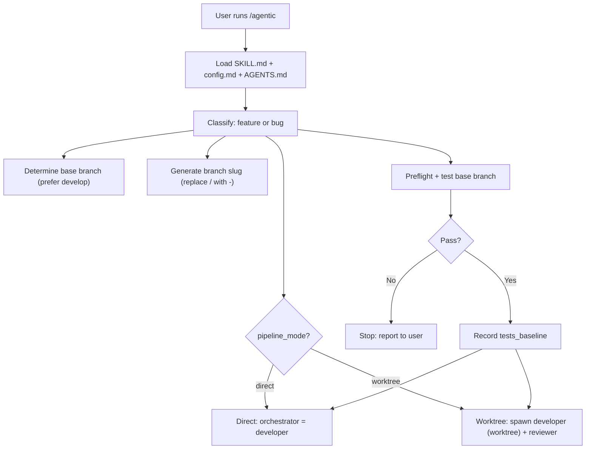
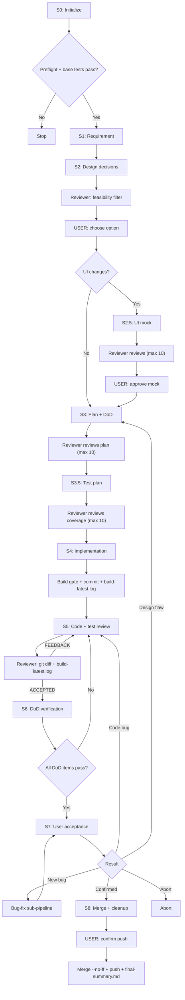
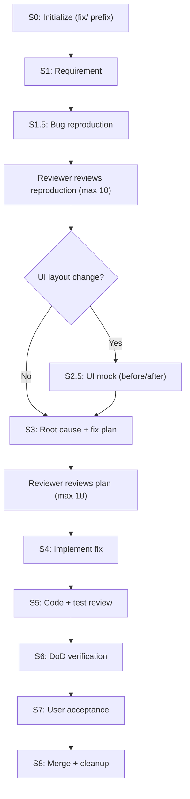
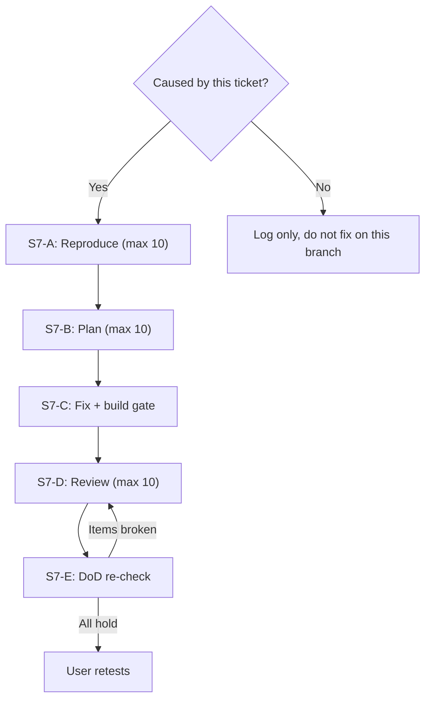
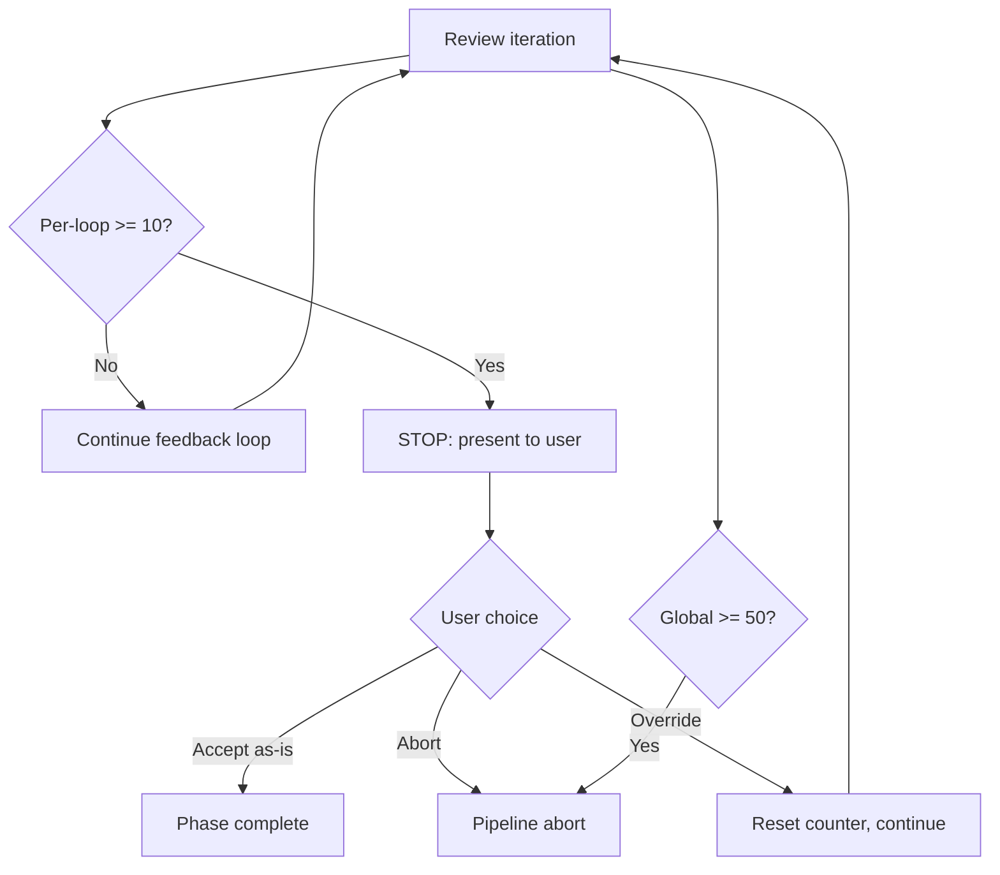
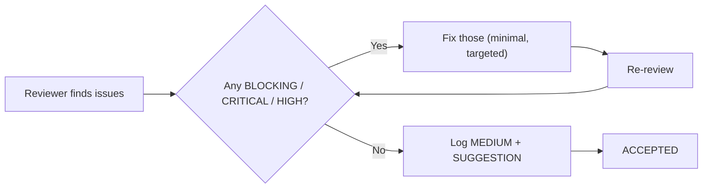

# Agentic Pipeline - Claude Code implementation

The same 8-step pipeline as `docs/AGENTIC_PIPELINE.md`, implemented for Claude Code
instead of kilo. Two independent implementations, one shared design and one shared
set of config and templates.

Invoke with `/agentic`.

## Source of truth

| Priority | File | Scope |
|----------|------|-------|
| 1 (highest) | `.agentic/config.md` | Build commands, pipeline mode, deploy, pen_cli |
| 2 | `.claude/skills/agentic/SKILL.md` | Full pipeline flow and step definitions |
| 3 | `.claude/agents/pipeline-reviewer.md` | Severity spec, gate rules, review checklist |
| 4 | `docs/REVIEW_RULES.md` | Auto-growing rule set, read every review iteration |
| 5 (lowest) | `AGENTS.md` | Project facts, device constraints, build/deploy commands |

Templates are shared with the kilo implementation. Project templates in
`.agentic/task-template/` override global ones in `~/.config/kilo/agent/task-template/`.

## What differs from the kilo implementation

The pipeline design is identical: same 8 steps, same feature and bug flows, same
severity ladder, same iteration caps, same measured-metrics rule, same review rules
lifecycle. Only the agent mechanics differ.

| Concern | kilo | Claude Code |
|---------|------|-------------|
| Orchestrator lives in | `~/.config/kilo/agent/agentic-orchestrator.md` (primary mode) | `.claude/skills/agentic/SKILL.md` (skill) |
| Reviewer definition | `.agentic/reviewer.md`, prepended to a prompt | `.claude/agents/pipeline-reviewer.md`, is the system prompt |
| Spawn reviewer | `agent_manager(mode: "local")` | `Agent` with `subagent_type: "pipeline-reviewer"` |
| Follow-up review | `action: "prompt"` with session id | `SendMessage` with the agent id |
| Get the verdict | poll `action: "list"`, then `kilo_local_recall` | returned directly by the tool call |
| Reviewer model | `reviewer_id` + `reviewer_variant` in config | `model:` in the agent frontmatter |
| Developer worktree | `agent_manager(mode: "worktree")` + manual `git worktree add/remove` | `Agent` with `isolation: "worktree"`, auto-cleaned |
| Stop a session | `action: "stop"` | subagents end when they return |
| Phase tracking | `state.md` only | `state.md` plus `TodoWrite` for live visibility |

Three consequences worth knowing:

**No polling.** Review gates are a single synchronous `Agent` call with
`run_in_background: false`. The verdict comes back in the tool result. The whole
poll-until-idle-then-recall dance in the kilo version has no equivalent here.

**Reviewer continuity is cheap.** `SendMessage` continues the same reviewer with
its context intact, so iteration N+1 already knows the accepted plan and the prior
feedback. Use it for every review after the first; a fresh `Agent` call starts cold
and re-derives everything.

**Subagents do not survive a session.** The kilo restart path can reattach to a
running reviewer. Here, restart always spawns a fresh reviewer and must re-send the
artifacts it needs for the current phase. In worktree mode the developer must also
be respawned with every approved artifact, since it has neither memory nor the
pipeline steps.

## Config fields

`.agentic/config.md` is shared. These fields apply to both implementations:

```
base_branch      develop
preflight        docker info
build/test/lint/cargo_fmt_check
deploy           printed to the user at S7
pen_cli          pen
max_per_loop     10
max_global       50
```

These are kilo-only and ignored by Claude Code, which reads the model from the
agent frontmatter instead:

```
reviewer_id / reviewer_variant
developer_id / developer_variant
pipeline_mode
```

`pipeline_mode` is kilo-only. Worktree is activated in both implementations
when the user's command mentions worktree, parallel work, or multiple tickets.
No config field controls this -- it's detected from the prompt.

To change the reviewer model here, edit `model:` in
`.claude/agents/pipeline-reviewer.md` (`opus`, `sonnet`, or `haiku`).

## Secrets

`PEN_CLI_KEY` and any provider key live in the user environment only, never in
`.agentic/config.md` - that file is tracked in git. The gitleaks pre-commit hook
catches accidents, but its config is machine-local, so it is a backstop rather
than a guarantee.

## Runtime unknowns

Two behaviors the documents cannot settle, worth confirming on a throwaway ticket
before trusting worktree mode with real work:

- Whether a subagent prompt can carry `mock-preview.png` as an image. S2.5 has a
  stated fallback (send prose, defer visual approval to the user) either way.
- How `isolation: "worktree"` interacts with a branch that already exists, and
  whether auto-cleanup can discard uncommitted developer work.

## Pipeline flows

### Startup



### Feature pipeline



### Bug pipeline



### Bug-fix sub-pipeline (within S7)



### Iteration limits



### Severity flow


