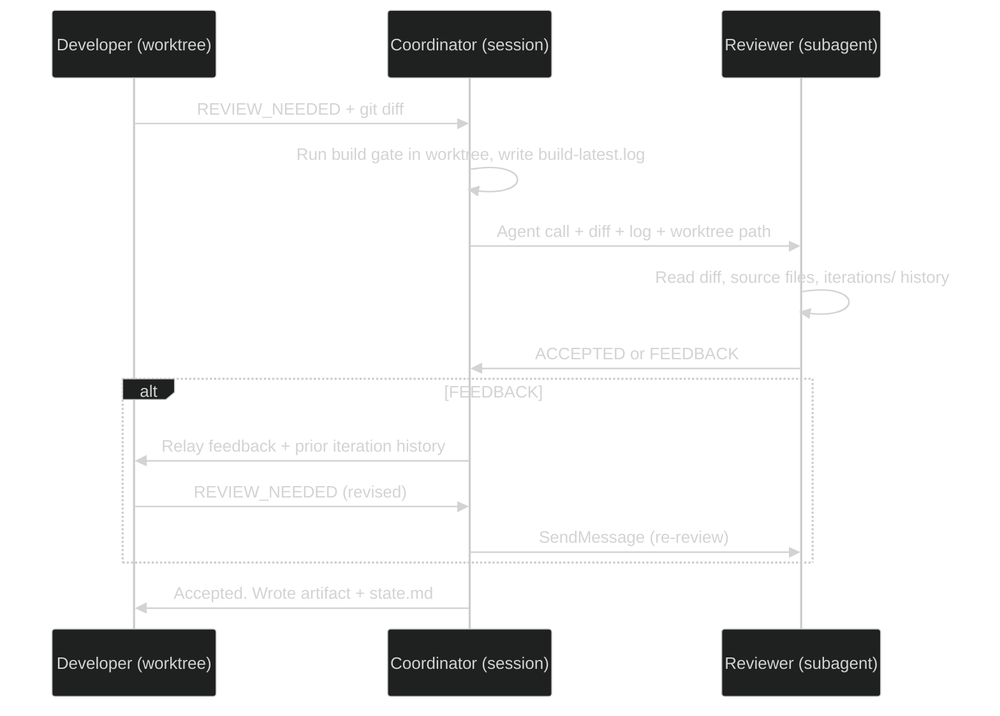
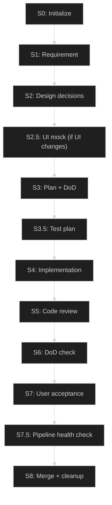
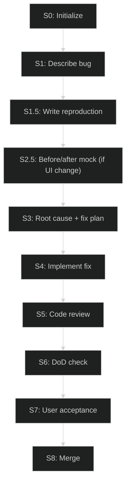
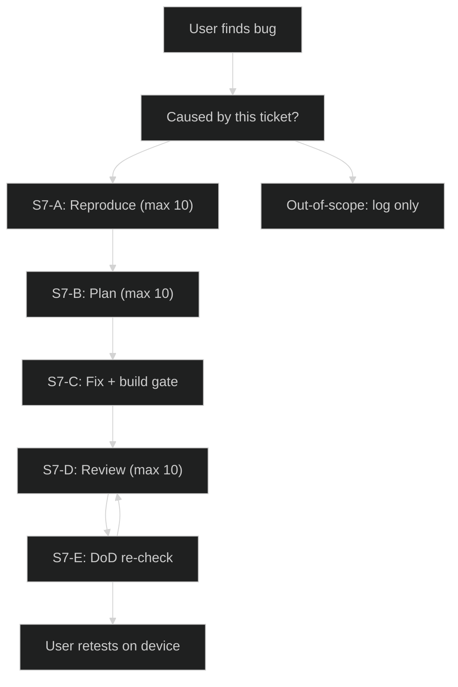
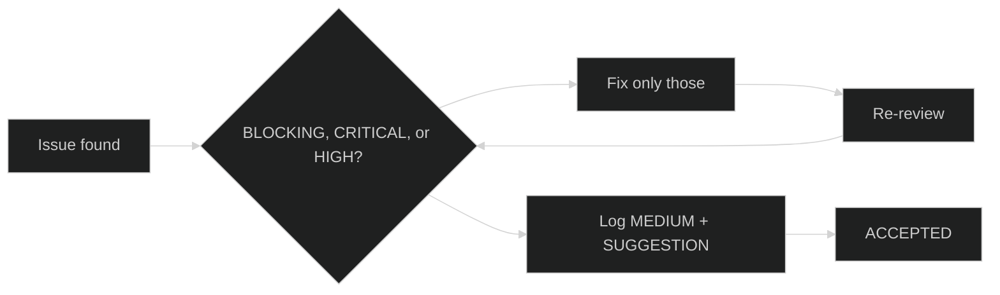

# Agentic Pipeline - Claude Code implementation

The same 8-step pipeline as `docs/AGENTIC_PIPELINE.md`, implemented for Claude Code
instead of kilo. Two independent implementations, one shared design and one shared
set of config and templates.

Invoke with `/agentic`.

## Source of truth

| Priority | File | Scope |
|----------|------|-------|
| 1 (highest) | `.agentic/config.md` | Build commands, deploy, pen_cli |
| 2 | `.claude/skills/agentic/SKILL.md` | Full pipeline flow and step definitions |
| 3 | `.claude/agents/pipeline-reviewer.md` | Project review checklist and any declared severity/decision deltas |
| 4 | `docs/REVIEW_RULES.md` | Project code rules (R##), read every review iteration |
| 5 (lowest) | `AGENTS.md` | Project facts, device constraints, build/deploy commands |

Templates are shared with the kilo implementation. Project templates in
`.agentic/task-template/` override global ones in `~/.config/kilo/agent/task-template/`,
whole-file -- a project template must carry the full structure, since anything it omits
is simply gone.

Conduct rules (D01-D03 developer, V01 reviewer) and pipeline rules (P##) are defined
once in `~/.config/kilo/agent/agentic-orchestrator.md` and apply to both implementations.
`docs/REVIEW_RULES.md` carries project code rules only, plus a one-line pointer to the
global conduct rules.

## What differs from the kilo implementation

The pipeline design is identical: same 8 steps plus S7.5, same feature and bug flows,
same severity ladder, same iteration caps, same measured-metrics rule, same review rules
lifecycle, same lessons learned injection. Only the agent mechanics differ.

| Concern | kilo | Claude Code |
|---------|------|-------------|
| Orchestrator lives in | `~/.config/kilo/agent/agentic-orchestrator.md` (primary mode) | `.claude/skills/agentic/SKILL.md` (skill) |
| Reviewer definition | `.agentic/reviewer.md`, prepended to a prompt | `.claude/agents/pipeline-reviewer.md`, is the system prompt |
| Spawn reviewer | `agent_manager(mode: "local")` | `Agent` with `subagent_type: "pipeline-reviewer"` |
| Follow-up review | `action: "prompt"` with session id | `SendMessage` with the agent id |
| Get the verdict | poll `action: "list"`, then `kilo_local_recall` | returned directly by the tool call |
| Reviewer model | `reviewer_id` + `reviewer_variant` in config | `model:` in the agent frontmatter |
| Developer worktree | `agent_manager(mode: "worktree")` + manual `git worktree add/remove` | `Agent` with `isolation: "worktree"`, auto-cleaned |
| Stop a session | `action: "stop"` | subagents end when they return |
| Phase tracking | `state.md` only | `state.md` plus `TodoWrite` for live visibility |

Three consequences worth knowing:

**No polling.** Review gates are a single synchronous `Agent` call with
`run_in_background: false`. The verdict comes back in the tool result. The whole
poll-until-idle-then-recall dance in the kilo version has no equivalent here.

**Reviewer continuity is cheap.** `SendMessage` continues the same reviewer with
its context intact, so iteration N+1 already knows the accepted plan and the prior
feedback. Use it for every review after the first; a fresh `Agent` call starts cold
and re-derives everything. Continuity is a convenience, not the source of truth --
the reviewer still reads `.agentic-tasks/<branch-slug>/iterations/` off disk each
round, which is what makes V01 auditable when a fresh agent replaces a continued one.

**Subagents do not survive a session.** The kilo restart path can reattach to a
running reviewer. Here, restart always spawns a fresh reviewer and must re-send the
artifacts it needs for the current phase. The on-disk `iterations/` history covers
the feedback context; iteration counts come from `state.md`, which is authoritative.
In worktree mode the developer must also be respawned with every approved artifact,
since it has neither memory nor the pipeline steps.

## Config fields

`.agentic/config.md` is shared. These fields apply to both implementations:

```
base_branch      develop
preflight        docker info          (optional -- S0 skips the step when absent)
build/test/lint/cargo_fmt_check
deploy           printed to the user at S7
pen_cli          pen
max_per_loop     10
max_global       50
```

These are kilo-only and ignored by Claude Code, which reads the model from the
agent frontmatter instead:

```
reviewer_id / reviewer_variant
developer_id / developer_variant
```

Worktree is activated in both implementations when the user's command mentions
worktree, parallel work, or multiple tickets. No config field controls this -- it is
detected from the prompt and pinned in `state.md` at S0.

To change the reviewer model here, edit `model:` in
`.claude/agents/pipeline-reviewer.md` (`opus`, `sonnet`, or `haiku`).

## Secrets

`PEN_CLI_KEY` and any provider key live in the user environment only, never in
`.agentic/config.md` - that file is tracked in git. The gitleaks pre-commit hook
catches accidents, but its config is machine-local, so it is a backstop rather
than a guarantee.

## Runtime unknowns

Two behaviors the documents cannot settle, worth confirming on a throwaway ticket
before trusting worktree mode with real work:

- Whether a subagent prompt can carry `mock-preview.png` as an image. S2.5 puts the
  user's visual approval first, so a reviewer that cannot see the PNG still reviews
  prose against design decisions -- the visual judgment has already happened.
- How `isolation: "worktree"` interacts with a branch that already exists, and
  whether auto-cleanup can discard uncommitted developer work.

## Verification independence

The gate is only as good as the evidence behind it. Three properties hold in both
implementations:

- The **orchestrator runs the build gate itself** and captures the real command output
  into `build-latest.log`. In worktree mode the coordinator runs it in the worktree path.
  A developer's `BUILD_RESULT` signal carries pass/fail only -- never a transcribed log.
- The reviewer may run **read-only git commands** (`git status`, `git diff`,
  `git rev-parse`, `git show`, `git log`), so `HEAD` and `TREE` in the log are
  independently checkable.
- The reviewer reads the **iteration history off disk**, not from whatever a prompt
  included, which keeps the relay out of the trust path.

In direct mode the source is in the current working directory and the reviewer reads
files directly; the inline diff is a convenience. In worktree mode source lives at the
worktree path, passed in the initial prompt.

## Worktree review flow



The developer receives the full prior-iteration history with every feedback relay --
it cannot reach the task directory, so this is the only way it can satisfy D01's
"fixed in iteration N at file:line" back-references.

## Pipeline flows

### Feature pipeline



| Step | What happens | Output | Passes when |
|------|-------------|--------|-------------|
| S0 | Lessons learned injected from last 3 tasks, preflight (if configured), base branch tested, branch created | Branch from develop, `tests_baseline` recorded | Preflight exits 0 and tests pass |
| S1 | Developer reads codebase, asks user to clarify if needed | `requirement.md` | Developer writes it |
| S2 | Developer proposes options, reviewer filters infeasible ones, user picks from what remains | `design-decisions.md` | User chose an option |
| S2.5 | Developer generates UI mock (Pencil), **user approves visually first**, then reviewer checks consistency against design decisions | `mock.pen`, `mock-preview.png`, `mock.md` | Skipped if no UI changes. Else user approves, then reviewer accepts (max 10 rounds) |
| S3 | Developer writes plan with architecture, files, risks, DoD. Reviewer reviews against actual source | `plan.md`, `definition-of-done.md` | Reviewer accepts plan (developer fixes feedback, max 10 rounds) |
| S3.5 | Developer writes test scenarios (no code). Reviewer checks coverage completeness | `test-plan.md` | Reviewer accepts coverage (developer fixes feedback, max 10 rounds) |
| S4 | Developer writes code + tests. Build gate runs (build, test, lint, fmt, gitleaks). Clean tree verified | Commit on branch, `build-latest.log` | All gates pass, tree clean outside `.agentic-tasks/` |
| S5 | Reviewer reads git diff + build log + iteration history. Feedback loop: developer fixes, rebuilds, re-submits | `iterations/N-review.md`, `iterations/N-response.md` | Reviewer says ACCEPTED (max 10 feedback rounds) |
| S6 | Reviewer reads source files and checks every DoD item against actual code | DoD verification result | Every item passes. Missing impl items go to S5; plan gaps go to S3 |
| S7 | Deploy instruction printed. User deploys to device, tests | User verdict (bug sub / S5 / S3 / abort / confirmed) | User confirmed |
| S7.5 | Pipeline scans its own iteration files for relay failures, avoidance patterns, enforcement gaps | "Pipeline health" section in the S7 summary | Always runs before S8 |
| S8 | Merge base into feature, rebuild, retest, reviewer reviews conflicts, user confirms push, end-of-task analysis, review rules lifecycle | `final-summary.md`, `merge-verify-build.log`, develop updated, new rules | User confirmed push |

### S0 detail

Lessons learned injection reads the **last 3 completed** `final-summary.md` files and
carries their "Preventive rules generated" and "Pipeline health" recommendations into
the run. Preflight is skipped when no `preflight` command is configured. The baseline
count is parsed as `TOTAL PASSED: N` when present, else the framework-specific pattern
(cargo `test result: ok. N passed`).

### S6 routing

An unmet DoD item routes by cause: incomplete implementation goes back to S5, while an
item the **plan** never covered goes back to S3 for a replan.

### S7.5 pipeline health check

Before merging, the pipeline scans every iteration file for: the same issue flagged 3+
times (relay bug or developer avoidance), the user repeating instructions the pipeline
already had (context loss), the reviewer re-flagging fixed items (V01), and deferred
BLOCKING items (D02). Findings are presented with the S7 summary; S8 reuses them rather
than re-scanning.

### S8 merge sequence

1. Pull base, re-run its tests, write `tests_base_at_merge` to `state.md` immediately.
2. Merge base into the feature branch, resolve conflicts.
3. Rebuild + retest. **Failure routes back to S5, never onward to push.**
4. Reviewer reviews conflict resolutions.
5. User explicitly confirms the push.
6. Re-fetch and verify base has not moved since step 1, then `--no-ff` merge and push.
7. `state.md` phase = S8.
8. Write `final-summary.md`.
9. End-of-task analysis: categorize every feedback item into R## (project code rule),
   D## (developer conduct), P## (pipeline), or a design note. Present to the user;
   write rules only on approval. R## goes to `docs/REVIEW_RULES.md`, D## and P## to the
   global orchestrator.

### Bug pipeline



Bug pipeline replaces S2 (design decisions) with S1.5 (reproduction). If the fix
changes UI layout, it routes through S2.5 before S3 to capture before/after visuals.

S1.5 reproduction types (illustrative -- use the project-appropriate equivalent):

| Bug type | Reproduction |
|----------|-------------|
| Logic, API, component, layout, rendering, touch | Failing test (must FAIL before fix) |
| Animation, timing, hardware-dependent | Given/When/Then script |

### Bug-fix sub-pipeline (within S7)

Triggered when the user finds a new bug during device testing that was caused by
this ticket's changes. Pre-existing bugs are logged but not fixed on this branch.



### Iteration limits

| Limit | Value | Scope |
|-------|-------|-------|
| Per-loop cap | 10 | Per review step |
| Global cap | 50 | Per pipeline |

When the per-loop cap is hit, the user chooses: accept as-is / abort / override
(costs 1 global). **When the global cap is hit the pipeline stops and offers the same
three choices** -- it writes `state.md`, keeps the branch, and waits. Nothing aborts
automatically, and a branch is never force-deleted on a counter breach. Deleting the
branch on an explicit abort still requires user confirmation; the default is keep.

### Severity flow



| Severity | Gates? | Action |
|----------|--------|--------|
| BLOCKING / CRITICAL / HIGH | Yes | Fix now (minimal, targeted). No sweep rule. |
| MEDIUM | No | Log. Fix if cheap. |
| SUGGESTION | No | Log only. |

The severity spec, gate rules, and decision criteria always reach the reviewer.
`.claude/agents/pipeline-reviewer.md` overrides only the sections it explicitly
redefines; everything else applies as written.

### Conduct rules

| Rule | Applies to | What it requires |
|------|-----------|-----------------|
| D01 | Developer | Every feedback item gets a matching response with the changed `file:line` |
| D02 | Developer | BLOCKING never deferrable; SUGGESTION only with reviewer agreement; no substitute refactoring |
| D03 | Developer | Re-run the build gate and re-check the flagged `file:line` before resubmitting |
| V01 | Reviewer | No repeated feedback -- verify the prior fix instead of re-flagging. Audited at S7.5 |
| P## | Pipeline | Generated by end-of-task analysis, stored globally, retired after 5+ quiet tasks |

### Measured metrics

`final-summary.md` numbers come from real commands, never estimates. Tests are reported
as three numbers -- `tests_baseline` (S0), `tests_base_at_merge` (S8 step 1), and
`TOTAL PASSED` (final) -- so drift on base between S0 and merge shows up as drift
instead of inflating the ticket's own delta. No token counts: iteration counts from
`state.md` are the cost metric.
